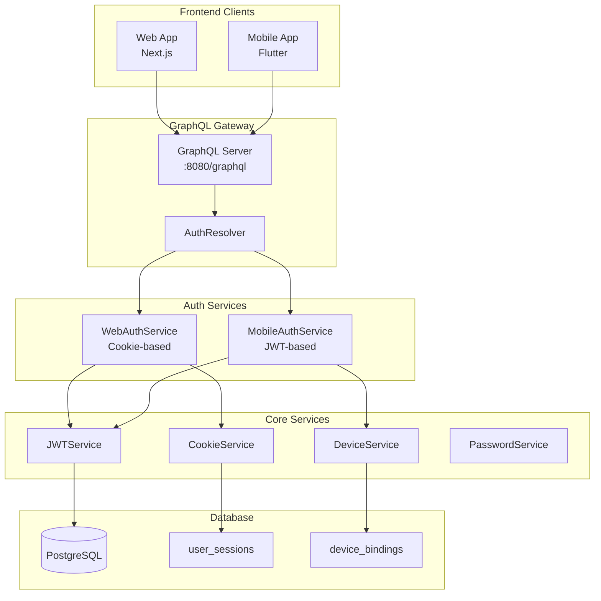
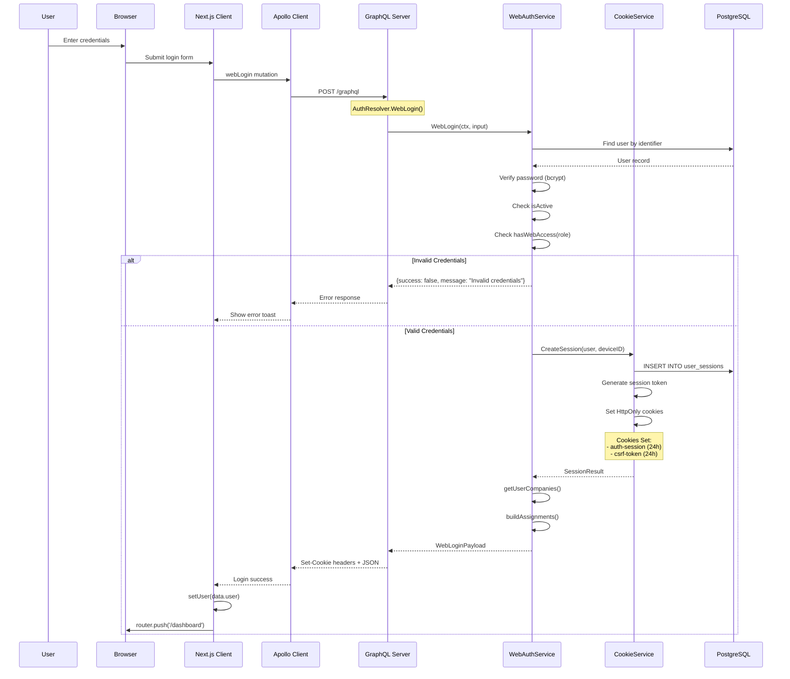
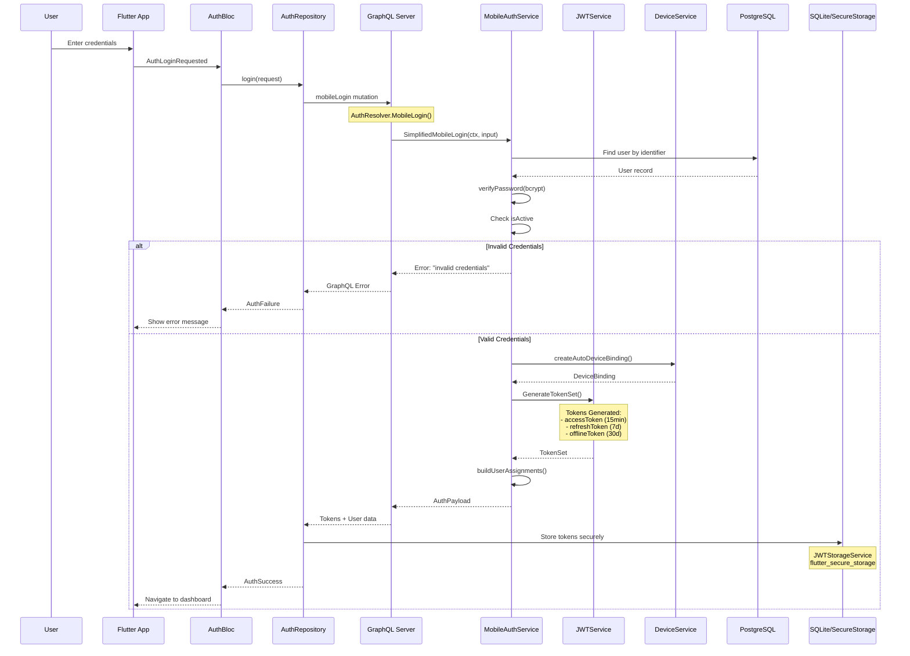
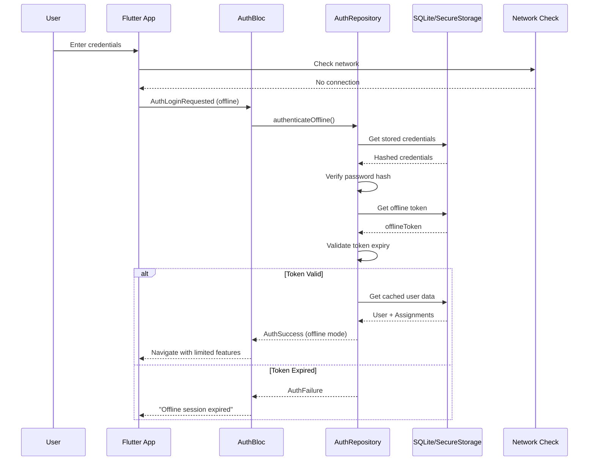
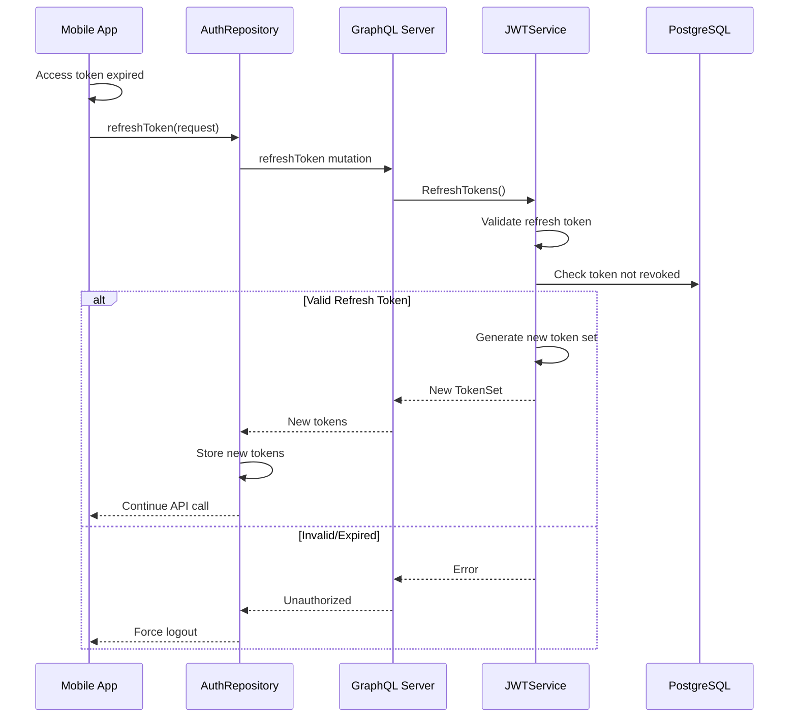
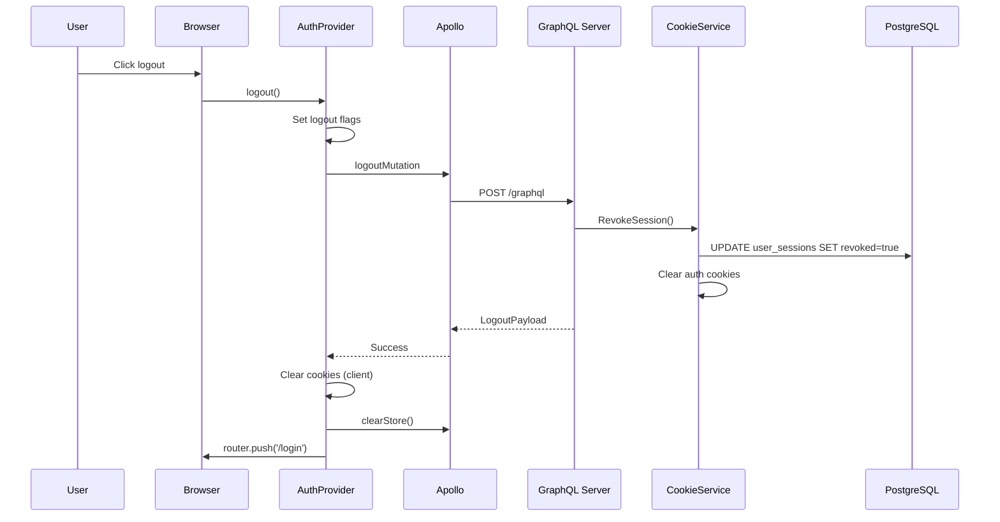
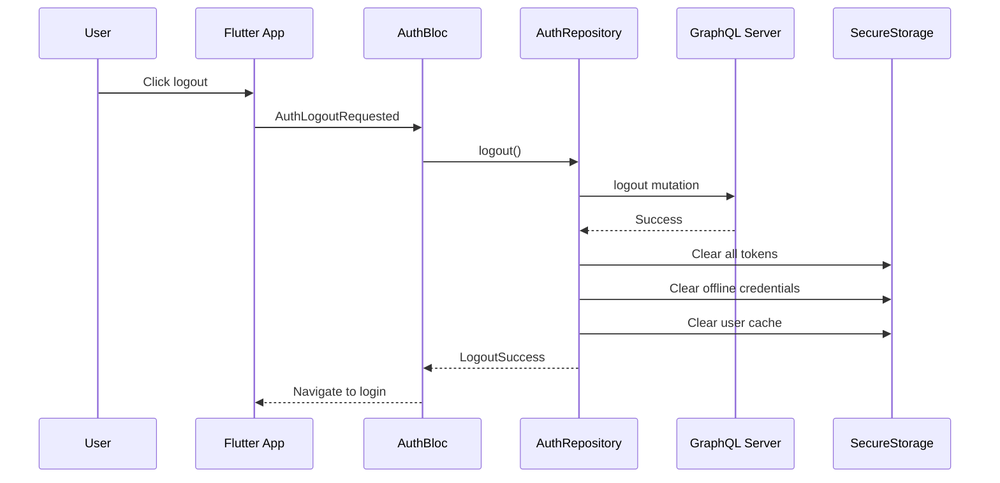

# 🔐 Agrinova Login Workflow Documentation

> **Version:** 1.0 | **Updated:** 2025-12-05  
> **Platforms:** Web (Next.js) | Mobile (Flutter)

---

## 📊 Architecture Overview



---

## 🌐 Web Login Flow

### GraphQL Mutation

```graphql
mutation WebLogin($input: WebLoginInput!) {
  webLogin(input: $input) {
    success
    message
    user {
      id
      username
      nama
      role
      company { id nama }
    }
    companies { id nama }
    assignments {
      estates { id nama }
      divisions { id nama }
    }
    sessionId
  }
}
```

### Sequence Diagram



### Technical Details

| Component | File | Description |
|-----------|------|-------------|
| **Frontend Form** | `apps/web/features/auth/components/LoginForm.tsx` | React Hook Form + Zod validation |
| **Auth Context** | `apps/web/features/auth/components/AuthProvider.tsx` | React Context + Apollo hooks |
| **GraphQL Query** | `apps/web/gql/graphql.ts` | Generated WebLoginDocument |
| **Backend Resolver** | `apps/golang/internal/auth/resolvers/auth_resolver.go` | Routes to WebAuthResolver |
| **Auth Service** | `apps/golang/internal/auth/services/web_auth_service.go` | Cookie-based session |
| **Cookie Service** | `apps/golang/internal/auth/services/cookie_service.go` | HttpOnly cookie management |

### Web Role Access Control

```go
// hasWebAccess - Roles that can access web dashboard
func hasWebAccess(role UserRole) bool {
    switch role {
    case SUPER_ADMIN, COMPANY_ADMIN, AREA_MANAGER, 
         MANAGER, ASISTEN, MANDOR, SATPAM:
        return true
    default:
        return false
    }
}
```

### Cookie Configuration

| Cookie | Type | Duration | Attributes |
|--------|------|----------|------------|
| `auth-session` | Session Token | 24 hours | HttpOnly, Secure, SameSite=Lax |
| `csrf-token` | CSRF Protection | 24 hours | SameSite=Strict |

---

## 📱 Mobile Login Flow

### GraphQL Mutation

```graphql
mutation MobileLogin($input: MobileLoginInput!) {
  mobileLogin(input: $input) {
    accessToken
    refreshToken
    offlineToken
    tokenType
    expiresIn
    expiresAt
    user {
      id
      username
      nama
      role
      company { id nama }
    }
    assignments {
      estates { id nama }
      divisions { id nama }
    }
  }
}
```

### Sequence Diagram



### Offline Authentication Flow



### Technical Details

| Component | File | Description |
|-----------|------|-------------|
| **Login Page** | `apps/mobile/lib/features/auth/presentation/pages/login_page.dart` | Gen Z glass morphism UI |
| **Auth Bloc** | `apps/mobile/lib/features/auth/presentation/blocs/auth_bloc.dart` | BLoC state management |
| **Repository** | `apps/mobile/lib/features/auth/data/repositories/auth_repository.dart` | API + offline logic |
| **JWT Storage** | `apps/mobile/lib/core/services/jwt_storage_service.dart` | Secure token storage |
| **Backend Resolver** | `apps/golang/internal/auth/resolvers/auth_resolver.go` | Routes to AuthService |
| **Auth Service** | `apps/golang/internal/auth/services/mobile_auth_service.go` | JWT + device binding |
| **JWT Service** | `apps/golang/internal/auth/services/jwt_service.go` | Token generation/validation |

### Token Configuration

| Token | Purpose | Duration | Usage |
|-------|---------|----------|-------|
| **accessToken** | API requests | 15 minutes | Bearer header |
| **refreshToken** | Token renewal | 7 days | Refresh endpoint |
| **offlineToken** | Offline access | 30 days | Local validation |

### Device Binding

```go
// Auto-generated device binding for simplified mobile login
type DeviceBinding struct {
    UserID            string
    DeviceID          string    // auto-{platform}-{userID[:8]}-{timestamp}
    DeviceFingerprint string    // mobile-{platform}-{username}
    Platform          PlatformType
    IsAuthorized      bool      // true for auto-generated
    IsTrusted         bool      // true for auto-generated
    LastSeenAt        time.Time
}
```

---

## 🔄 Token Refresh Flow



---

## 🚪 Logout Flow

### Web Logout



### Mobile Logout



---

## 🎭 Role-Based Assignment Loading

### Assignment by Role

| Role | Companies | Estates | Divisions | Description |
|------|-----------|---------|-----------|-------------|
| **SUPER_ADMIN** | All | All | All | System-wide access |
| **COMPANY_ADMIN** | Own | All in company | All in company | Company-wide management |
| **AREA_MANAGER** | Assigned | Assigned | - | Multi-company monitoring |
| **MANAGER** | Own | Assigned | - | Multi-estate monitoring |
| **ASISTEN** | Own | Assigned | Assigned | Division management |
| **MANDOR** | Own | Assigned | Assigned | Field operations |
| **SATPAM** | Own | - | - | Gate check only |

### Assignment Loading Logic

```go
// buildUserAssignments - Role-based data loading
func buildUserAssignments(ctx, user) *UserAssignments {
    switch user.Role {
    case SATPAM:
        return companyOnly(user)
    case MANDOR, ASISTEN:
        return estatesAndDivisions(user)
    case MANAGER:
        return estatesOnly(user)
    case AREA_MANAGER:
        return companiesAndEstates(user)
    case SUPER_ADMIN:
        return fullSystemAccess(user)
    }
}
```

---

## 🔒 Security Features

### Password Security
- **Algorithm:** bcrypt with cost factor 10
- **Storage:** Hashed in `users.password` column
- **Verification:** Server-side only

### Token Security
- **Signing:** HS256 (HMAC-SHA256)
- **Claims:** userID, username, role, companyID, deviceID, platform
- **Rotation:** Refresh tokens rotated on use

### Session Security
- **HttpOnly Cookies:** Prevents XSS token theft
- **CSRF Token:** Required for state-changing operations
- **Session Tracking:** IP, User-Agent, Last activity

### Offline Security
- **Credential Hashing:** SHA-256 for offline password verification
- **Token Encryption:** flutter_secure_storage (Keystore/Keychain)
- **Expiration:** 30-day offline token limit

---

## 📝 Error Handling

### Common Error Codes

| Error | HTTP | Description | Resolution |
|-------|------|-------------|------------|
| `invalid credentials` | 401 | Wrong username/password | Check credentials |
| `user account is inactive` | 403 | User disabled | Contact admin |
| `web access not authorized` | 403 | Role can't access web | Use mobile app |
| `session expired` | 401 | Token/cookie expired | Re-login |
| `device not authorized` | 403 | Device binding failed | Re-register device |

---

## 🧪 Testing Commands

### Backend Tests
```bash
# Run auth service tests
cd apps/golang
go test ./internal/auth/services/... -v

# Run specific test
go test -run TestMobileLogin ./internal/auth/services/
```

### Mobile Tests
```bash
# Run Flutter auth tests
cd apps/mobile
flutter test test/integration/login_test.dart
```

### Manual Testing
1. **Web Login:** http://localhost:3001/login
2. **Mobile Login:** Run `flutter run` on device/emulator
3. **Demo credentials:** `mandor/demo123`, `satpam/demo123`, etc.

---

## 📁 Folder Structure (Refactored - Clean Architecture)

### Backend (Go) - Auth Module

```
apps/golang/internal/auth/features/
├── 📁 web/                              # Web Login Feature (Cookie-based)
│   ├── 📁 application/
│   │   └── service.go                   # Web auth business logic (7.6KB)
│   │       ├── Login()                  # Cookie authentication
│   │       ├── Logout()                 # Session revocation
│   │       ├── ValidateSession()        # Session validation
│   │       └── RefreshSession()         # Session refresh
│   │
│   ├── 📁 domain/
│   │   └── service.go                   # Web domain interfaces (1.8KB)
│   │       ├── WebLoginInput
│   │       ├── WebLoginResult
│   │       └── CookieService interface
│   │
│   ├── 📁 infrastructure/
│   │   └── cookie_service.go            # HttpOnly cookie management (4.6KB)
│   │       ├── SetAuthCookies()
│   │       ├── ClearAuthCookies()
│   │       └── GenerateCSRFToken()
│   │
│   └── 📁 interfaces/graphql/
│       └── resolver.go                  # GraphQL mutations (7.3KB)
│           ├── WebLogin mutation
│           ├── WebLogout mutation
│           └── CurrentUser query
│
├── 📁 mobile/                           # Mobile Login Feature (JWT-based)
│   ├── 📁 application/
│   │   └── service.go                   # Mobile auth business logic (11.9KB)
│   │       ├── Login()                  # JWT authentication
│   │       ├── Logout()                 # Token revocation
│   │       ├── RefreshToken()           # Token refresh
│   │       ├── ValidateOfflineAccess()  # Offline token validation
│   │       ├── BindDevice()             # Device binding
│   │       └── UnbindDevice()           # Device unbinding
│   │
│   ├── 📁 domain/
│   │   └── service.go                   # Mobile domain interfaces (4KB)
│   │       ├── MobileLoginInput
│   │       ├── MobileLoginResult
│   │       ├── DeviceBindingInput
│   │       └── TokenService interface
│   │
│   ├── 📁 infrastructure/
│   │   └── jwt_service.go               # JWT token generation (9KB)
│   │       ├── GenerateAccessToken()
│   │       ├── GenerateRefreshToken()
│   │       ├── GenerateOfflineToken()
│   │       └── ValidateToken()
│   │
│   └── 📁 interfaces/graphql/
│       └── resolver.go                  # GraphQL mutations (9.1KB)
│           ├── MobileLogin mutation
│           ├── RefreshToken mutation
│           ├── BindDevice mutation
│           └── Me query
│
└── 📁 shared/                           # Shared Components
    ├── 📁 domain/
    │   ├── user.go                      # User entity & DTO (6.9KB)
    │   ├── repository.go                # Repository interfaces (5.9KB)
    │   │   ├── UserRepository
    │   │   ├── SessionRepository
    │   │   ├── DeviceRepository
    │   │   └── AssignmentRepository
    │   └── services.go                  # Shared service interfaces
    │
    └── 📁 infrastructure/
        ├── 📁 postgres/                 # Database Repositories
        │   ├── user_repository.go       # User CRUD (8KB)
        │   ├── session_repository.go    # Session management (5.8KB)
        │   ├── device_repository.go     # Device binding (6.8KB)
        │   ├── assignment_repository.go # User assignments (7.8KB)
        │   ├── company_repository.go    # Company data (2.6KB)
        │   ├── estate_repository.go     # Estate data (2.6KB)
        │   ├── division_repository.go   # Division data (3.2KB)
        │   └── security_event_repository.go  # Audit logs (4.2KB)
        │
        ├── 📁 security/
        │   ├── password_service.go      # bcrypt hashing (1.8KB)
        │   └── security_logger.go       # Security event logging (2.9KB)
        │
        ├── 📁 logging/
        │   └── (audit logging)
        │
        └── 📁 error_handling/
            └── (custom errors)
```

### Mobile (Flutter) - Auth Feature

```
apps/mobile/lib/features/auth/
├── 📁 data/                             # Data Layer
│   ├── 📁 repositories/
│   │   └── auth_repository.dart         # API + Offline logic (58KB)
│   │       ├── login()                  # GraphQL mobileLogin
│   │       ├── refreshToken()           # Token refresh
│   │       ├── logout()                 # Clear all tokens
│   │       ├── authenticateOffline()    # Offline authentication
│   │       └── authenticateWithBiometric()
│   │
│   ├── 📁 graphql/
│   │   └── auth_queries.dart            # GraphQL documents
│   │
│   └── 📁 services/
│       └── graphql_auth_service.dart
│
├── 📁 presentation/                     # Presentation Layer
│   ├── 📁 blocs/
│   │   ├── auth_bloc.dart               # Main BLoC (17KB)
│   │   ├── auth_event.dart              # Login/Logout events
│   │   ├── auth_state.dart              # Auth states
│   │   └── biometric_auth_bloc.dart     # Biometric BLoC
│   │
│   ├── 📁 pages/
│   │   ├── login_page.dart              # Gen Z UI (22KB)
│   │   ├── auth_wrapper.dart            # Auth state wrapper
│   │   ├── biometric_settings_page.dart # Biometric settings
│   │   └── unauthorized_page.dart       # Access denied
│   │
│   └── 📁 widgets/
│       └── (shared auth widgets)
│
└── 📁 domain/                           # Domain Layer
    └── (interfaces)
```

### Web (Next.js) - Auth Feature

```
apps/web/features/auth/
├── 📁 components/
│   ├── AuthProvider.tsx                 # Context + Apollo (10KB)
│   │   ├── useAuth hook
│   │   ├── login()
│   │   ├── logout()
│   │   └── session management
│   │
│   ├── LoginForm.tsx                    # Form UI (14KB)
│   │   ├── React Hook Form
│   │   ├── Zod validation
│   │   └── Demo quick login
│   │
│   └── 📁 __tests__/
│       └── LoginForm.test.tsx
│
├── 📁 graphql/
│   └── queries.ts                       # GraphQL documents
│
└── 📁 hooks/
    └── useAuth.ts                       # Hook export
```

---

## 📊 Clean Architecture Summary

| Layer | Web | Mobile | Shared |
|-------|-----|--------|--------|
| **Application** | Cookie auth | JWT auth | - |
| **Domain** | WebLoginInput, CookieService | MobileLoginInput, TokenService | User, Repository interfaces |
| **Infrastructure** | cookie_service.go | jwt_service.go | PostgreSQL repos, bcrypt |
| **Interfaces** | GraphQL resolver | GraphQL resolver | - |
