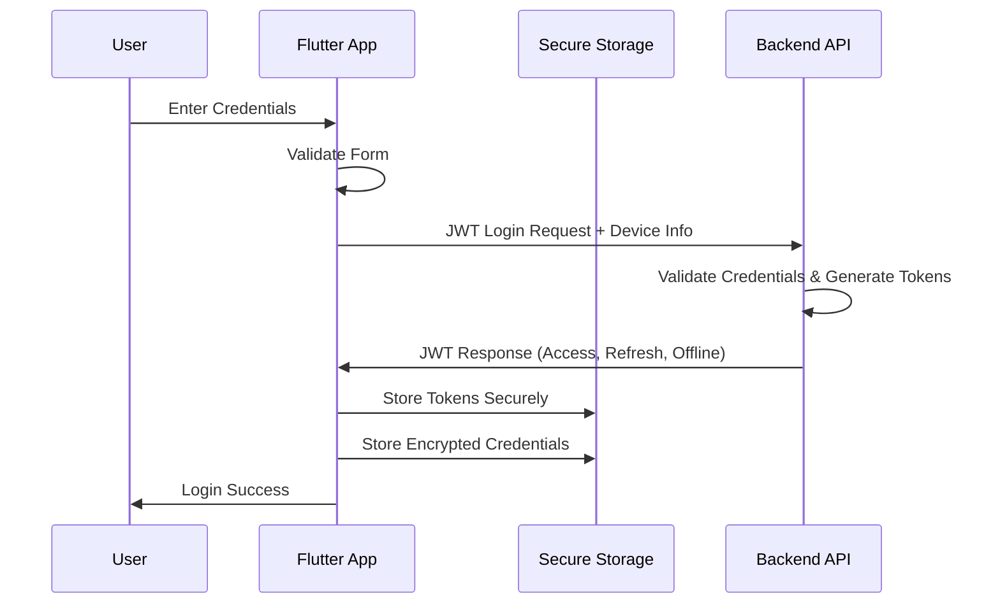
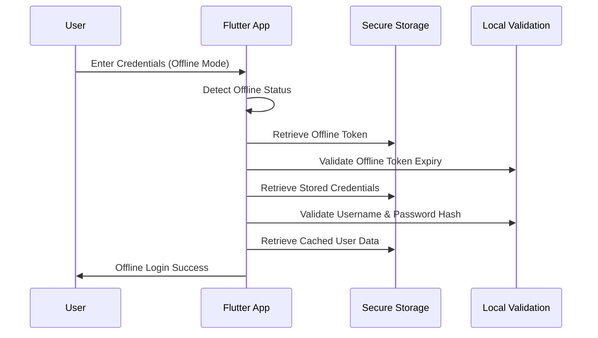

# Flutter Offline Authentication Implementation Guide

## Overview

This guide documents the comprehensive offline authentication implementation for the Agrinova Flutter mobile application. The system supports 30-day offline operation with hardware-backed security and biometric integration.

## 🏗️ Architecture Overview

### Core Components

```
┌─────────────────────────────────────────────────────────────┐
│                    Flutter Mobile App                        │
├─────────────────────────────────────────────────────────────┤
│  AuthRepository (Abstract Interface)                        │
│  └── AuthRepositoryImpl (Concrete Implementation)           │
│      ├── Online Authentication (JWT API)                    │
│      ├── Offline Authentication (Encrypted Credentials)     │
│      └── Biometric Authentication (local_auth)              │
├─────────────────────────────────────────────────────────────┤
│  Security Layer                                             │
│  ├── Flutter Secure Storage (Hardware-backed)              │
│  ├── JWT Storage Service (Token Management)                 │
│  └── Device Service (Fingerprinting & Trust)                │
├─────────────────────────────────────────────────────────────┤
│  Offline Data Layer                                         │
│  ├── SQLite Local Database                                  │
│  ├── Sync Service (Background Synchronization)              │
│  └── Connectivity Service (Network Detection)               │
└─────────────────────────────────────────────────────────────┘
```

## 🔐 Security Implementation

### 1. Flutter Secure Storage Configuration

**Hardware-Backed Security:**
- **Android**: Uses Android Keystore with encrypted SharedPreferences
- **iOS**: Uses iOS Keychain with hardware security module

```dart
static const _secureStorage = FlutterSecureStorage(
  aOptions: AndroidOptions(
    encryptedSharedPreferences: true,
    sharedPreferencesName: 'agrinova_jwt_prefs',
    preferencesKeyPrefix: 'agrinova_',
  ),
  iOptions: IOSOptions(
    groupId: 'group.com.agrinova.app',
    accountName: 'agrinova_keychain',
    accessibility: IOSAccessibility.first_unlock_this_device,
  ),
);
```

### 2. JWT Token Management

**Three-Tier Token System:**
- **Access Token**: 15-minute validity for API calls
- **Refresh Token**: 7-day validity for token renewal
- **Offline Token**: 30-day validity for offline operation

```dart
// Token Storage Structure
{
  "jwt_access_token": "eyJhbGciOiJIUzI1NiIsInR5cCI6IkpXVCJ9...",
  "jwt_refresh_token": "eyJhbGciOiJIUzI1NiIsInR5cCI6IkpXVCJ9...",
  "jwt_offline_token": "eyJhbGciOiJIUzI1NiIsInR5cCI6IkpXVCJ9...",
  "device_binding": "flutter-device-binding-hash",
  "user_info": "encrypted-user-data",
  "session_info": "encrypted-session-data",
  "token_expires_at": "2025-08-28T12:00:00.000Z",
  "offline_expires_at": "2025-09-27T12:00:00.000Z",
  "device_trusted": "true"
}
```

### 3. Offline Credential Storage

**Encrypted Password Storage:**
```dart
// Credentials are hashed and stored securely
{
  "username": "mandor1",
  "passwordHash": "sha256-hash-with-agrinova-salt",
  "timestamp": "2025-08-28T12:00:00.000Z"
}
```

**Security Features:**
- SHA-256 hashing with application-specific salt
- Timestamp tracking for credential validation
- Automatic cleanup on logout

### 4. Biometric Authentication

**Local Authentication Integration:**
```dart
// Biometric Setup
final isAuthenticated = await _localAuth.authenticate(
  localizedReason: 'Autentikasi untuk mengakses aplikasi Agrinova',
  options: const AuthenticationOptions(
    biometricOnly: false,     // Allow PIN/Pattern fallback
    stickyAuth: true,         // Require authentication on app resume
  ),
);
```

**Supported Biometric Types:**
- **Android**: Fingerprint, Face unlock, Iris
- **iOS**: Touch ID, Face ID

## 🔄 Authentication Flow

### 1. Online Authentication Flow



### 2. Offline Authentication Flow



### 3. Biometric Authentication Flow

```mermand
sequenceDiagram
    participant U as User
    participant A as Flutter App
    participant B as Biometric System
    participant S as Secure Storage
    
    U->>A: Request Biometric Login
    A->>A: Check Biometric Availability
    A->>B: Request Biometric Authentication
    B->>U: Show Biometric Prompt
    U->>B: Provide Biometric
    B->>A: Authentication Result
    A->>S: Retrieve Cached User Data
    A->>U: Biometric Login Success
```

## 📱 User Interface Features

### 1. Network Status Indicator

**Real-time Connectivity Display:**
- **Online Mode**: Green indicator with WiFi icon
- **Offline Mode**: Orange indicator with offline icon
- **Offline Available**: Green checkmark when offline auth is available

### 2. Adaptive Login Button

**Context-Aware Button Text:**
- **Online**: "Login"
- **Offline**: "Login Offline"
- **Disabled**: Grey when offline auth unavailable

### 3. Offline Mode Help

**User Guidance:**
- Information panel explaining offline capabilities
- Clear messaging about feature limitations
- Guidance for restoring online connectivity

## 🔧 Technical Implementation

### 1. AuthRepository Interface

```dart
abstract class AuthRepository {
  // Standard Authentication
  Future<JWTLoginResponse> login(JWTLoginRequest request);
  Future<JWTRefreshResponse> refreshToken(JWTRefreshRequest request);
  Future<void> logout();
  
  // Offline Authentication
  Future<JWTLoginResponse> authenticateOffline(String username, String password);
  Future<bool> validateOfflineToken(JWTOfflineValidationRequest request);
  
  // Biometric Authentication
  Future<bool> isBiometricAvailable();
  Future<bool> isBiometricEnabled();
  Future<bool> setupBiometric(bool enable, String reason);
  Future<bool> authenticateWithBiometric();
  
  // Device Management
  Future<bool> requestDeviceTrust();
  Future<void> registerDevice(DeviceRegistrationRequest request);
  
  // Security
  Future<bool> changePassword(String oldPassword, String newPassword);
  
  // Status
  Stream<bool> get authStatusStream;
}
```

### 2. Key Services

**JWTStorageService:**
- Secure token storage and retrieval
- JWT payload parsing and validation
- Expiration time management
- Authentication status checking

**DeviceService:**
- Unique device ID generation
- Device fingerprinting for security
- Platform-specific device information
- Device registration data creation

**SyncService:**
- Background data synchronization
- Offline operation queuing
- Connectivity-based sync triggers
- Conflict resolution for offline changes

## 🚀 Offline Capabilities

### 1. Supported Offline Operations

**Operational Roles:**
- **Mandor**: Harvest data input, offline storage
- **Asisten**: Approval workflow, offline processing  
- **Satpam**: Gate check logging, QR scanning
- **Manager**: Data monitoring, offline reports
- **Area Manager**: Cross-company oversight

### 2. Data Synchronization

**Background Sync:**
- Automatic sync when connectivity restored
- Queued operation processing
- Failed operation retry logic
- Data conflict resolution

**Sync Queue Structure:**
```dart
{
  "id": "operation-timestamp-id",
  "type": "harvest_create|gate_check_create|approval_update",
  "data": { /* operation data */ },
  "timestamp": "2025-08-28T12:00:00.000Z",
  "status": "pending|failed",
  "error": "optional-error-message"
}
```

### 3. Offline Limitations

**Restricted Operations:**
- User management (requires online)
- Real-time notifications (cached for sync)
- Cross-device data sharing (delayed)
- Password changes on server (local only)

## 🔒 Security Best Practices

### 1. Token Security

**JWT Validation:**
- Signature verification for all tokens
- Expiration time enforcement
- Device binding validation
- Offline token scope limitations

**Token Refresh Strategy:**
- Proactive refresh before expiration
- Fallback to offline token when refresh fails
- Automatic logout on token invalidation

### 2. Device Security

**Device Fingerprinting:**
- Multi-factor device identification
- Hardware-based fingerprint generation
- Fingerprint consistency validation
- Anti-tampering protection

**Trust Management:**
- Device trust establishment
- Trust revocation capability
- Suspicious activity detection
- Device registration tracking

### 3. Data Protection

**Encryption Standards:**
- AES-256 for sensitive data storage
- SHA-256 for password hashing
- Hardware security module integration
- Secure key derivation functions

## 🧪 Testing Strategy

### 1. Unit Tests

**Authentication Methods:**
```dart
// Test offline authentication
testWidgets('should authenticate offline with valid credentials', (tester) async {
  // Arrange
  when(mockJWTStorage.hasValidOfflineAuth()).thenAnswer((_) async => true);
  when(mockSecureStorage.read(key: 'offline_credentials'))
      .thenAnswer((_) async => validCredentialsJson);
  
  // Act
  final result = await authRepository.authenticateOffline('mandor1', 'password');
  
  // Assert
  expect(result.user.username, 'mandor1');
  expect(result.deviceTrusted, isTrue);
});
```

### 2. Integration Tests

**End-to-End Flows:**
- Complete login to dashboard flow
- Offline to online transition
- Biometric setup and usage
- Data synchronization after reconnection

### 3. Security Testing

**Vulnerability Assessment:**
- Token extraction attempts
- Credential storage security
- Biometric bypass testing
- Device fingerprint spoofing

## 📊 Performance Considerations

### 1. Storage Optimization

**Efficient Data Access:**
- Lazy loading of user data
- Cached authentication status
- Minimal secure storage operations
- Background storage cleanup

### 2. Battery Optimization

**Power-Efficient Operations:**
- Reduced background sync frequency
- Conditional biometric prompts
- Optimized connectivity checking
- Efficient token validation

### 3. Memory Management

**Resource Conservation:**
- Proper stream subscription disposal
- Cached service instances
- Minimal data retention
- Automatic cache cleanup

## 🐛 Troubleshooting

### 1. Common Issues

**Authentication Failures:**
```dart
// Debug authentication status
final authStatus = await jwtStorageService.getAuthStatus();
print('Auth Status: $authStatus');
// Output: {hasAccessToken: true, isAuthenticated: false, needsTokenRefresh: true}
```

**Offline Mode Problems:**
```dart
// Check offline authentication availability  
final hasOfflineAuth = await jwtStorageService.hasValidOfflineAuth();
final offlineExpiry = await jwtStorageService.getOfflineTokenExpirationTime();
print('Offline Auth Available: $hasOfflineAuth, Expires: $offlineExpiry');
```

### 2. Debug Commands

**Storage Inspection:**
```dart
// View stored authentication data
final authHeaders = await jwtStorageService.getAuthHeaders();
final deviceTrusted = await jwtStorageService.isDeviceTrusted();
final userInfo = await jwtStorageService.getUserInfo();
```

**Sync Status:**
```dart
// Monitor synchronization status
final syncStatus = await syncService.getSyncStatus();
print('Sync Status: ${syncStatus['isSyncing']}, Pending: ${syncStatus['pendingOperations']}');
```

## 🔄 Migration Guide

### 1. From Basic Auth to JWT

**Data Migration:**
```dart
// Migrate existing user data to JWT format
if (await _hasLegacyAuth()) {
  final legacyUser = await _getLegacyUserData();
  await _migrateToJWTAuth(legacyUser);
  await _cleanupLegacyAuth();
}
```

### 2. Upgrading Offline Capabilities

**Version Compatibility:**
- Backward compatibility for existing tokens
- Graceful degradation for unsupported features
- Automatic migration of storage format
- Progressive enhancement of security features

## 📋 Checklist for Implementation

### 1. Security Implementation
- [ ] Flutter Secure Storage configured with hardware backing
- [ ] JWT tokens stored with proper encryption
- [ ] Password hashing implemented with salt
- [ ] Device fingerprinting active
- [ ] Biometric authentication integrated
- [ ] Device trust management functional

### 2. Offline Capabilities
- [ ] 30-day offline token validation
- [ ] Encrypted credential storage
- [ ] Offline login flow implemented
- [ ] Data synchronization working
- [ ] Network status detection active
- [ ] Offline UI indicators functional

### 3. User Experience
- [ ] Login page supports offline mode
- [ ] Network status clearly displayed
- [ ] Biometric login available when enabled
- [ ] Error messages informative
- [ ] Loading states implemented
- [ ] Accessibility compliance verified

### 4. Testing Coverage
- [ ] Unit tests for all authentication methods
- [ ] Integration tests for offline flows
- [ ] Security testing completed
- [ ] Performance benchmarks established
- [ ] Error handling verified
- [ ] Cross-platform compatibility tested

## 📚 Additional Resources

### 1. Flutter Packages Used
- `flutter_secure_storage`: Hardware-backed secure storage
- `local_auth`: Biometric authentication
- `dart_jsonwebtoken`: JWT token parsing and validation
- `crypto`: Cryptographic functions for hashing
- `device_info_plus`: Device information gathering
- `connectivity_plus`: Network connectivity monitoring

### 2. Security Standards
- OWASP Mobile Security Guidelines
- Flutter Security Best Practices
- JWT Security Recommendations
- Biometric Authentication Standards

---

**Implementation Status: ✅ Complete**
- **JWT Authentication**: Fully implemented with device binding
- **Offline Authentication**: 30-day offline operation supported
- **Biometric Integration**: Hardware-backed biometric authentication
- **Security Architecture**: Enterprise-grade security measures
- **User Experience**: Seamless online/offline transitions
- **Data Synchronization**: Robust background sync system

**Next Steps:**
1. Deploy to test environment for validation
2. Conduct security audit and penetration testing
3. Performance optimization and battery usage analysis
4. User acceptance testing with field operations
5. Production deployment with monitoring setup