# Mobile Authentication System

## Overview
This document outlines the authentication architecture, token management, and verification flows for the Agrinova mobile application. The system supports both online JW based authentication and a robust offline-first mode for specific roles (Mandor, Satpam).

## Token System

The application uses a dual-token system plus a specialized offline token:

| Token Type | Lifespan | Storage | Purpose |
|------------|----------|---------|---------|
| **Access Token** | 15 minutes | Secure Storage | Authenticating API requests. Short-lived for security. |
| **Refresh Token** | 7 days | Secure Storage | Obtaining new access tokens without user intervention. |
| **Offline Token** | 30 days | Secure Storage | Enabling offline access for Mandor/Satpam roles. |

## Authentication Flow

The application determines the user's state based on connectivity and token validity upon launch.

```mermaid
graph TD
    Start([🚀 App Launch]) --> CheckAuth{Is Authenticated?}
    
    %% Authenticated Branch
    CheckAuth -- Yes --> CheckExpiry{Token Expired?}
    
    CheckExpiry -- No --> Dashboard([📱 Dashboard])
    CheckExpiry -- Yes --> OnlineCheck1{Is Online?}
    
    OnlineCheck1 -- Yes --> RefreshCheck{Refresh Token Valid?}
    OnlineCheck1 -- No --> OfflineFlow
    
    RefreshCheck -- Yes --> DoRefresh[🔄 Auto-Refresh]
    RefreshCheck -- No --> Login([🔐 Login Page])
    
    DoRefresh --> RefreshSuccess{Success?}
    RefreshSuccess -- Yes --> Dashboard
    RefreshSuccess -- No --> Login

    %% Not Authenticated Branch
    CheckAuth -- No --> CheckOfflineBranch{Is Online?}
    
    CheckOfflineBranch -- Yes --> Login
    CheckOfflineBranch -- No --> CheckValidOffline{Has Valid Offline Token?}
    
    CheckValidOffline -- No --> Login
    CheckValidOffline -- Yes --> OfflineFlow
    
    subgraph OfflineAccess [Offline Mode Flow]
    OfflineFlow{Role Support Offline?}
    OfflineFlow -- No --> Login
    OfflineFlow -- Yes --> BioCheck{Biometric Enabled?}
    
    BioCheck -- No --> OfflineDash([📡 Offline Dashboard])
    BioCheck -- Yes --> PromptBio[/👆 Verify Biometric/]
    
    PromptBio --> BioSuccess{Verified?}
    BioSuccess -- Yes --> OfflineDash
    BioSuccess -- No --> Login
    end
    
    classDef success fill:#d4edda,stroke:#155724,stroke-width:2px,color:#155724;
    classDef danger fill:#f8d7da,stroke:#721c24,stroke-width:2px,color:#721c24;
    classDef warning fill:#fff3cd,stroke:#856404,stroke-width:2px,color:#856404;
    classDef primary fill:#cce5ff,stroke:#004085,stroke-width:2px,color:#004085;
    
    class Dashboard,OfflineDash success;
    class Login danger;
    class DoRefresh,PromptBio warning;
    class Start primary;
```

## Scenarios & Behaviors

### Online Scenarios

| Initial State | Token Condition | System Action | User Result |
|---------------|-----------------|---------------|-------------|
| **App Launch** | Access Token Valid | Validate Expiry (Local) | ✅ Direct Dashboard Access |
| **App Launch** | Access Expired, Refresh Valid | Auto-Refresh via API | 🔄 Seamless Dashboard Access |
| **App Launch** | All Tokens Expired | Clear Session | 🔒 Redirect to Login Page |
| **Usage** | 401 Unauthorized API | Auto-Refresh | 🔄 Retry Request (Seamless) |

### Offline Scenarios (Mandor & Satpam Only)

Offline access requires a valid `offlineToken` which is obtained during a successful online login.

1.  **Validation**:
    *   System checks if device is offline.
    *   System validates if `offlineToken` exists and is within the 30-day window.
    
2.  **Biometric Verification (Optional)**:
    *   If user has enabled Biometric/PIN security, they will be prompted to verify identity before offline access is granted.
    *   **Success**: Grants access to Offline Dashboard.
    *   **Failure**: Access denied, returns to Login screen.

3.  **Role Restriction**:
    *   Roles like **Manager**, **Asisten**, **Admin** do *not* have offline access credentials and will be blocked if launching offline.

## Implementation Details

### Key Components

*   **`UnifiedSecureStorageService`**: Centralized storage for all tokens. Handles local validation logic including `_isTokenExpired()`.
*   **`AuthBloc`**: Manages the state machine.
    *   `_onAuthCheckRequested`: Orchestrates the initial check flow.
    *   `_onAuthBiometricRequested`: Handles the biometric verification step specifically for offline entrance.
*   **`AuthWrapper`**: Routes the user to Dashboard, Login, or Offline Verification screens based on `AuthBloc` state.

### Security Notes

*   **Token Expiry**: Local validation prevents the app from opening with a stale token, ensuring security even before hitting the API.
*   **Offline Security**: Biometric verification adds a layer of security for cached data access when offline.
