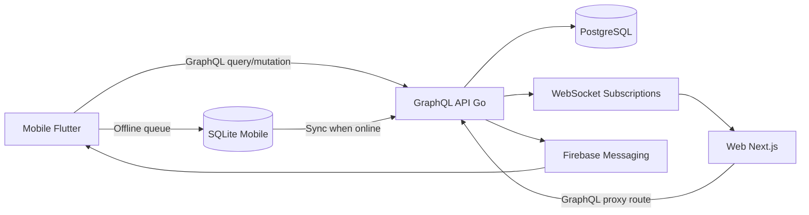
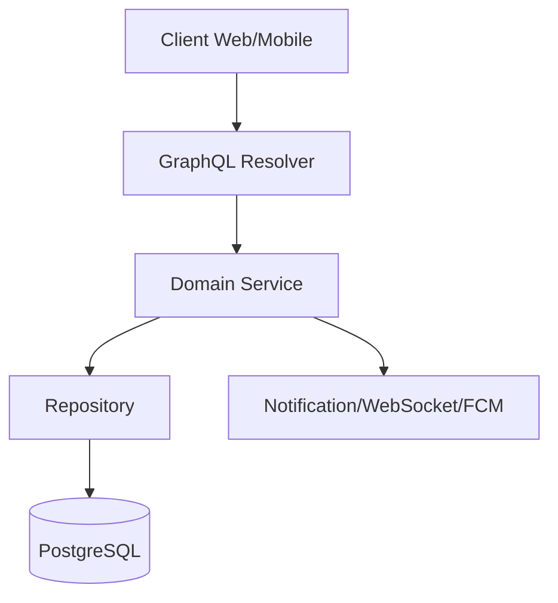
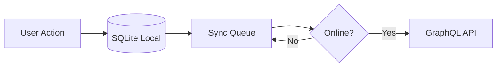

# AgrInova Platform and Module Documentation

Dokumen ini menjelaskan platform dan modul AgrInova berdasarkan struktur kode di repository `D:\VSCODE\agrinova`.

## 1. Tujuan dan Cakupan

Tujuan dokumen:

1. Menjadi peta teknis tunggal untuk memahami platform AgrInova.
2. Menjelaskan modul utama, fungsi, dan relasi antar modul.
3. Mempermudah onboarding engineer, QA, dan tim operasional.

Cakupan dokumen:

1. Backend API (`apps/golang`)
2. Web Dashboard (`apps/web`)
3. Mobile App (`apps/mobile`)
4. Shared/Core package (`core`, `libs`, `packages`)

Ringkasan inventaris implementasi saat dokumen dibuat:

1. `20` modul top-level backend di `apps/golang/internal`
2. `26` schema GraphQL di `apps/golang/internal/graphql/schema`
3. `44` halaman App Router di `apps/web/app/**/page.tsx`
4. `20` feature module web di `apps/web/features`
5. `9` feature module mobile di `apps/mobile/lib/features`

## 2. Ringkasan Platform

| Platform | Lokasi | Stack Inti | Fungsi Utama |
|---|---|---|---|
| Backend API | `apps/golang` | Go 1.24, Gin, gqlgen, GORM, PostgreSQL, WebSocket | Sumber data utama, GraphQL API, auth, RBAC, sync, notifikasi |
| Web Dashboard | `apps/web` | Next.js 16 App Router, React 19, Apollo Client, Tailwind, shadcn/ui | Monitoring real-time, master data, approval, admin, reporting |
| Mobile App | `apps/mobile` | Flutter 3.38+, Dart 3.8+, BLoC, GraphQL, SQLite | Operasional lapangan, mode offline-first, sinkronisasi data |
| Shared/Core | `core`, `libs`, `packages` | TypeScript shared DTO/type/util + UI package | Kontrak data lintas app, utilitas bersama, komponen reusable |

## 3. Arsitektur Multi-Platform

Alur inti sistem:

1. Mobile menyimpan transaksi lapangan ke SQLite saat offline.
2. Saat online, mobile menjalankan sync ke GraphQL API.
3. Web membaca data operasional dari API dan menerima update real-time.
4. Backend menerapkan auth, RBAC, validasi domain, dan persistensi ke PostgreSQL.

## 4. Backend Platform (`apps/golang`)

### 4.1 Struktur Layer Backend

| Layer | Direktori | Fungsi |
|---|---|---|
| Entry points | `cmd` | Server startup, seeding, migrasi, utilitas verifikasi |
| Domain modules | `internal/*` | Business logic per domain (`panen`, `gatecheck`, `rbac`, dll) |
| GraphQL | `internal/graphql` | Schema, resolver generated/manual, directive/scalar |
| Infra package | `pkg` | Database, middleware, helper infra bersama |
| Operasional | `migrations`, `scripts`, `release` | Migrasi DB, script release, deployment utilities |

### 4.2 Modul Internal Backend dan Fungsinya

| Modul | Lokasi | Fungsi Utama | Aktor/Consumer | Status |
|---|---|---|---|---|
| `auth` | `internal/auth` | Login web/mobile, JWT/session/cookie, device, logout, role authorization | Semua platform | Active |
| `cache` | `internal/cache` | Dukungan cache untuk performa dan session related flow | Backend internal | Active (support) |
| `employee` | `internal/employee` | Layanan data pekerja untuk proses panen/monitoring | Mandor, Asisten, Manager | Active |
| `features` | `internal/features` | Feature toggle/composition service dan resolver terkait | Admin/Super Admin | Active |
| `gatecheck` | `internal/gatecheck` | Registrasi dan validasi aktivitas gerbang kendaraan | Satpam, Asisten, Manager | Active |
| `grading` | `internal/grading` | Pengelolaan data grading kualitas hasil | Operasional kebun/PKS | Active |
| `graphql` | `internal/graphql` | Integrasi GraphQL root resolver, subscription hub, upload handler | Web/Mobile client | Active |
| `master` | `internal/master` | Master data company-estate-division-block dan konteks panen | Admin, Manager | Active |
| `middleware` | `internal/middleware` | Middleware auth, request guard, cross-cutting concern | Semua request API | Active |
| `notifications` | `internal/notifications` | Notification service dan FCM pipeline | Asisten, Manager, Satpam | Active |
| `panen` | `internal/panen` | CRUD dan workflow data panen serta event panen | Mandor, Asisten, Manager | Active |
| `perawatan` | `internal/perawatan` | Modul maintenance/perawatan kebun | Operasional kebun | Active |
| `pks` | `internal/pks` | Integrasi data pabrik (PKS) dan proses terkait | Manager/Operasional | Active |
| `rbac` | `internal/rbac` | Manajemen role, permission, dan enforcement akses | Admin/Super Admin | Active |
| `routes` | `internal/routes` | Perakitan HTTP routes non-GraphQL/support endpoint | Backend runtime | Active (support) |
| `security` | `internal/security` | Security utility dan pengujian keamanan | Backend/internal | Active (support) |
| `sync` | `internal/sync` | Sinkronisasi data mobile termasuk BKM sync/report | Mandor, Satpam, sistem sync | Active |
| `testing` | `internal/testing` | Fixture, integration/performance test helper | QA/Engineer | Active (testing) |
| `websocket` | `internal/websocket` | Subscription handling, connection manager, rate limiter | Web real-time dashboard | Active |
| `weighing` | `internal/weighing` | Data timbang/timbangan operasional | Timbangan, Manager | Active |

### 4.3 Domain API GraphQL Berdasarkan Schema

Schema tersedia pada `internal/graphql/schema/*.graphqls`:

| Domain Schema | Fungsi Utama API |
|---|---|
| `auth`, `session`, `token_management`, `api-keys`, `fcm_token` | Autentikasi, manajemen session, token, API key, device token |
| `master`, `database`, `company_admin`, `super_admin`, `area_manager` | Master data dan kontrol administrasi multi-level |
| `manager`, `asisten`, `mandor`, `satpam` | API role-specific untuk dashboard dan aksi operasional |
| `grading`, `perawatan`, `pks`, `timbangan`, `bkm_report`, `bkm_sync`, `bkm_company_bridge` | Domain operasional kebun, PKS, timbangan, BKM |
| `rbac`, `features`, `notifications`, `common`, `schema` | Permission model, feature flags, notifikasi, common type |

### 4.4 Alur Backend ke Data

## 5. Web Platform (`apps/web`)

### 5.1 Fungsi Platform Web

Web berfungsi sebagai pusat kontrol operasional dan administrasi:

1. Monitoring real-time aktivitas panen dan gate-check.
2. Workflow approval.
3. Manajemen master data organisasi.
4. Administrasi user, role, assignment, API key, dan session.
5. Pelaporan dan analitik.

### 5.2 Modul Feature Web (`apps/web/features`)

| Modul Feature | Fungsi | Dependensi Utama | Status |
|---|---|---|---|
| `auth` | Form login, hook auth, integrasi GraphQL auth | Apollo, auth service | Active |
| `dashboard` | Komponen dashboard umum lintas role | role routing, chart/widget | Active |
| `manager-dashboard` | Halaman dan service dashboard manager | query manager, reporting | Active |
| `asisten-dashboard` | Dashboard asisten untuk approval/monitoring | query asisten, approval flow | Active |
| `mandor-dashboard` | Dashboard mandor untuk operasional panen | harvest input/history | Active |
| `satpam-dashboard` | Dashboard satpam untuk gate-check | gate-check query/mutation | Active |
| `super-admin-dashboard` | Dashboard level sistem dan tata kelola global | admin analytics, rbac | Active |
| `company-admin-dashboard` | Dashboard admin perusahaan | user/company management | Active |
| `area-manager-dashboard` | Monitoring lintas estate/company | monitor multi company | Active |
| `approvals` | Komponen approval dashboard dan action | approval API | Active |
| `harvest` | Komponen/form/utility domain panen | harvest query/mutation | Active |
| `grading-dashboard` | UI domain grading | grading query | Active |
| `timbangan-dashboard` | UI domain timbangan | weighing query | Active |
| `master-data` | Komponen CRUD master data | company/estate/division/block | Active |
| `user-management` | Hook, komponen, validasi konflik assignment | user/assignment API | Active |
| `vehicles` | Manajemen data kendaraan | gate-check + vehicle API | Active |
| `workers` | Dashboard pekerja/tenaga kerja | employee/worker data | Active |
| `perawatan` | Modul perawatan kebun di web | perawatan GraphQL | Active |
| `schedule` | Komponen jadwal operasional | schedule query | Active |
| `history` | Komponen histori aktivitas | history/monitoring data | Active |

### 5.3 Modul Route App Router (`apps/web/app`)

| Route/Module | Fungsi Bisnis |
|---|---|
| `/login` | Masuk aplikasi (web auth) |
| `/` | Landing dan role-aware routing |
| `/harvest` | Operasi dan monitoring data panen |
| `/approvals` | Proses persetujuan/review data |
| `/gate-check`, `/gate-check/sync` | Operasi gerbang dan sinkronisasi gate-check |
| `/timbangan` | Dashboard timbang |
| `/grading` | Pengelolaan grading |
| `/perawatan` | Aktivitas perawatan kebun |
| `/reports`, `/analytics` | Pelaporan dan analitik |
| `/monitor/company/[companyId]` | Monitoring tersegmentasi perusahaan |
| `/companies`, `/estates`, `/divisions`, `/blocks` | Master data organisasi kebun |
| `/employees`, `/tim`, `/vehicles` | Data SDM dan armada |
| `/users`, `/users/new`, `/users/[id]/edit`, `/assignments` | User dan assignment management |
| `/rbac-management`, `/api-management`, `/api-keys` | Tata kelola akses dan API |
| `/management-sessions`, `/management-token` | Manajemen sesi dan token |
| `/budget-blok`, `/budget-divisi`, `/tarif-blok`, `/bkm-company-bridge` | Modul budgeting dan BKM bridge |
| `/settings`, `/change-password`, `/profile` | Preferensi pengguna dan keamanan akun |
| `/struktur-organisasi` | Visualisasi struktur organisasi |
| `/privacy-policy`, `/terms-of-service` | Halaman kebijakan dan ketentuan |
| `/admin/device-stats` | Statistik perangkat (admin) |
| `animation-test`, `component-test`, `auth-test` | Halaman development/testing internal |

### 5.4 API Route Web (Proxy/Utility)

| API Route | Fungsi |
|---|---|
| `app/api/graphql/route.ts` | Proxy GraphQL HTTP ke backend |
| `app/api/graphql/ws/route.ts` | Proxy/subscription WebSocket |
| `app/api/admin/system-statistics/route.ts` | Statistik admin |
| `app/api/admin/rbac-roles/route.ts` | RBAC role API helper |
| `app/api/admin/multi-assignment-analytics/route.ts` | Analitik assignment |
| `app/api/test-auth/route.ts`, `app/api/test-direct-auth/route.ts` | Endpoint testing/auth debugging |

## 6. Mobile Platform (`apps/mobile`)

### 6.1 Fungsi Platform Mobile

Mobile difokuskan untuk operasional lapangan dengan pola offline-first:

1. Input data lapangan (terutama panen dan gate-check).
2. Tetap bisa beroperasi saat jaringan terbatas.
3. Sinkronisasi aman saat koneksi kembali normal.
4. Dashboard sesuai role.

### 6.2 Modul Feature Mobile (`apps/mobile/lib/features`)

| Modul | Fungsi | Layer | Status |
|---|---|---|---|
| `auth` | Login/logout, token handling, validasi online/offline | `data/domain/presentation` | Active |
| `dashboard` | Dashboard per role (manager, company admin, super admin, area manager) | `data/presentation` | Active |
| `harvest` | Input panen, state BLoC, entity panen | `data/domain/presentation` | Active |
| `gate_check` | Operasi gate-check, queue foto/sync progress, entity gate check | `data/domain/presentation` | Active |
| `approval` | Workflow approval di mobile | `data/domain/presentation` | Active |
| `monitoring` | Monitoring dashboard dan ringkasan aktivitas | `data/presentation` | Active |
| `profile` | Profil pengguna dan state profile | `data/presentation` | Active |
| `settings` | Pengaturan aplikasi dan admin settings page | `pages` | Active |
| `debug` | Halaman debug database dan utilitas pengujian | `pages` | Active (internal) |

### 6.3 Core dan Shared Mobile

| Modul Core/Shared | Lokasi | Fungsi |
|---|---|---|
| Core config/constants | `lib/core/config`, `lib/core/constants` | Konfigurasi app dan konstanta runtime |
| Database and repository | `lib/core/database`, `lib/core/repositories` | Local DB SQLite dan repository base |
| DI and services | `lib/core/di`, `lib/core/services` | Dependency injection dan service lintas fitur |
| GraphQL/network/interceptor | `lib/core/graphql`, `lib/core/network`, `lib/core/interceptors` | Akses API, retry, transport layer |
| Route/theme/utils | `lib/core/routes`, `lib/core/theme`, `lib/core/utils` | Navigasi, tema, utility |
| Shared widgets/utils | `lib/shared/widgets`, `lib/shared/utils` | Komponen UI bersama |

### 6.4 Alur Offline-First Mobile

## 7. Shared/Core Lintas Platform

| Modul | Lokasi | Fungsi Utama |
|---|---|---|
| DTO package | `core/dto` | Data transfer object lintas service (common dan panen) |
| Shared services | `core/services` | Business utility bersama |
| Shared utils | `core/utils` | Utility helper lintas domain |
| Shared constants/types/utils | `libs/shared` | Enum role, base interface, konstanta sinkronisasi, resolver util |
| Shared package | `packages/shared` | Reusable package internal tambahan |
| UI package | `packages/ui` | Komponen UI reusable berbasis React/TS |

## 8. Matriks Integrasi Antar Modul

| Domain Bisnis | Mobile | Web | Backend | Data Store | Real-time |
|---|---|---|---|---|---|
| Auth and Session | `features/auth` | `features/auth`, `/login` | `internal/auth`, schema `auth/session/token_management` | PostgreSQL + secure storage mobile | Session update, event auth |
| Harvest Panen | `features/harvest` | `/harvest`, `features/harvest` | `internal/panen`, `internal/master` | PostgreSQL + SQLite (offline) | Subscription/update dashboard |
| Gate Check | `features/gate_check` | `/gate-check` | `internal/gatecheck` | PostgreSQL + SQLite (offline) | Alert/status live |
| Approval | `features/approval` | `/approvals`, `features/approvals` | resolver role `asisten/manager` + service domain | PostgreSQL | Status workflow live |
| Timbangan and Grading | support via dashboard/ops | `/timbangan`, `/grading` | `internal/weighing`, `internal/grading`, schema `timbangan/grading` | PostgreSQL | Dashboard refresh |
| RBAC and Admin | role aware access | `/rbac-management`, `/users`, `/api-*` | `internal/rbac`, `internal/features`, `internal/auth` | PostgreSQL | Admin monitoring |
| Notification | device messaging | notification components | `internal/notifications`, `internal/websocket`, schema `notifications/fcm_token` | PostgreSQL/FCM | WebSocket + FCM push |
| Sync BKM/Offline | sync queue + retry | monitoring/sync page | `internal/sync`, schema `bkm_sync/bkm_report` | PostgreSQL + SQLite | Sync status event |

## 9. Modul ke Path (Quick Index)

### 9.1 Backend

1. `apps/golang/internal/auth`
2. `apps/golang/internal/master`
3. `apps/golang/internal/panen`
4. `apps/golang/internal/gatecheck`
5. `apps/golang/internal/rbac`
6. `apps/golang/internal/sync`
7. `apps/golang/internal/notifications`
8. `apps/golang/internal/weighing`
9. `apps/golang/internal/grading`
10. `apps/golang/internal/perawatan`
11. `apps/golang/internal/pks`
12. `apps/golang/internal/websocket`
13. `apps/golang/internal/graphql`

### 9.2 Web

1. `apps/web/app`
2. `apps/web/features`
3. `apps/web/lib/apollo/queries`
4. `apps/web/lib/auth`
5. `apps/web/components`

### 9.3 Mobile

1. `apps/mobile/lib/features`
2. `apps/mobile/lib/core`
3. `apps/mobile/lib/shared`

### 9.4 Shared

1. `core/dto`
2. `core/services`
3. `core/utils`
4. `libs/shared`
5. `packages/shared`
6. `packages/ui`

## 10. Catatan Pemeliharaan Dokumen

Aturan update dokumen ini:

1. Tambahkan modul baru ke tabel platform yang relevan saat direktori domain/feature baru dibuat.
2. Update matriks integrasi saat ada perubahan alur data utama.
3. Sinkronkan bagian schema jika file di `apps/golang/internal/graphql/schema` bertambah/berkurang.
4. Pastikan route table web diupdate saat ada route `page.tsx` baru.
5. Tandai modul experimental/testing secara eksplisit agar tidak disalahartikan sebagai fitur produksi.

---

Dokumen ini adalah baseline arsitektur modular AgrInova berbasis implementasi repository saat ini.
