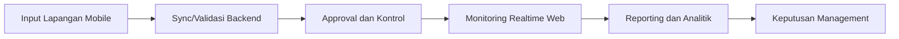

# AgrInova Management Report

Dokumen ini adalah ringkasan manajemen untuk memahami posisi platform AgrInova, kapabilitas utama, dampak bisnis, serta prioritas eksekusi.

## 1. Executive Summary

AgrInova adalah platform operasional kebun sawit yang mengintegrasikan:

1. Aplikasi mobile lapangan (offline-first) untuk input operasional.
2. Dashboard web untuk kontrol, monitoring, dan tata kelola.
3. Backend API terpusat untuk validasi, keamanan, sinkronisasi, dan pelaporan.

Nilai bisnis utama:

1. Mempercepat siklus data dari lapangan ke manajemen.
2. Mengurangi kehilangan data saat jaringan tidak stabil.
3. Meningkatkan kontrol proses panen, gate-check, approval, dan pelaporan.
4. Menegakkan kontrol akses berbasis peran (RBAC) untuk keamanan operasional.

## 2. Cakupan Platform Saat Ini

Snapshot implementasi (berdasarkan struktur project saat ini):

1. Backend: `20` modul domain internal.
2. API GraphQL: `26` schema domain.
3. Web dashboard: `44` halaman App Router.
4. Web feature modules: `20` modul.
5. Mobile feature modules: `9` modul.

## 3. Kapabilitas Bisnis per Platform

| Platform | Peran Bisnis | Kapabilitas Utama |
|---|---|---|
| Mobile App | Eksekusi lapangan | Input panen, gate-check, approval mobile, sinkronisasi offline-online |
| Web Dashboard | Command center manajemen | Monitoring real-time, master data, approval, RBAC, laporan & analitik |
| Backend API | Mesin kontrol sistem | Validasi bisnis, auth/session, sinkronisasi data, notifikasi, integrasi domain |

## 4. Modul Proses Bisnis dan Fungsinya

| Domain Proses | Fungsi Operasional | Dampak ke Management |
|---|---|---|
| Auth & Session | Login aman web/mobile, manajemen token/session | Mengurangi risiko akses tidak sah |
| RBAC & Admin | Kontrol hak akses per role/perusahaan | Governance dan auditability lebih baik |
| Master Data | Company/Estate/Division/Block/User/Assignment | Data organisasi lebih konsisten untuk keputusan |
| Harvest (Panen) | Input, validasi, histori, monitoring panen | Kecepatan visibilitas output panen harian |
| Gate Check | Registrasi kendaraan, status masuk/keluar, sinkronisasi | Kontrol pergerakan TBS dan keamanan operasional |
| Approval Workflow | Review dan persetujuan data operasional | Menurunkan error data sebelum pelaporan |
| Timbangan & Grading | Pencatatan kualitas dan bobot | Dasar analitik produktivitas dan kualitas |
| Perawatan | Aktivitas perawatan operasional | Kontrol biaya dan efektivitas pemeliharaan |
| Reporting & Analytics | Dashboard KPI dan tren | Keputusan lebih cepat berbasis data aktual |
| Notifications & Realtime | Update event kritikal via web socket/FCM | Respons operasional lebih cepat |
| Sync & Offline | Queue data saat offline, kirim ulang saat online | Continuity operasional di area sinyal lemah |

## 5. Value Chain Operasional yang Didukung

## 6. KPI Management yang Direkomendasikan

KPI prioritas untuk dipantau mingguan/bulanan:

1. `Data Freshness`  
   Persentase data operasional yang masuk dashboard <= 30 menit dari waktu input.
2. `Approval SLA`  
   Rata-rata waktu dari submit hingga approve/reject.
3. `Offline Recovery Rate`  
   Persentase data offline yang berhasil tersinkron tanpa intervensi manual.
4. `Gate Compliance`  
   Persentase kendaraan dengan proses gate-check lengkap (masuk-keluar valid).
5. `Harvest Accuracy`  
   Selisih data panen lapangan vs data final timbangan/PKS.
6. `System Availability`  
   Ketersediaan backend + web dashboard.
7. `Security Hygiene`  
   Jumlah insiden akses tidak sah, token abuse, atau pelanggaran permission.

## 7. Risiko Utama dan Mitigasi

| Risiko | Dampak | Mitigasi yang Disarankan |
|---|---|---|
| Kualitas data master tidak konsisten | Laporan bias/salah keputusan | Perkuat validasi master data dan audit berkala |
| Bottleneck approval | Keterlambatan reporting operasional | Tetapkan SLA approval + dashboard alert backlog |
| Kegagalan sync di area sinyal lemah | Data telat masuk pusat | Monitoring sync queue harian + retry policy terukur |
| Sprawl permission antar role | Risiko keamanan dan konflik akses | Review RBAC triwulanan + matriks akses formal |
| Kesenjangan adopsi user lapangan | Data tidak lengkap | Program pelatihan role-based dan SOP penggunaan |

## 8. Prioritas Eksekusi 90 Hari

### Prioritas 1: Stabilitas Operasional

1. Tetapkan baseline KPI (freshness, approval SLA, sync success).
2. Buat dashboard manajemen untuk health status platform.
3. Definisikan owner dan target tiap KPI lintas tim.

### Prioritas 2: Kualitas Data dan Governance

1. Standardisasi master data (company/estate/division/block/user).
2. Terapkan review berkala assignment dan permission role.
3. Jalankan audit data mismatch panen vs timbangan secara periodik.

### Prioritas 3: Efisiensi Keputusan

1. Satukan laporan operasional harian/mingguan untuk manajemen.
2. Tambahkan early warning untuk backlog approval dan gagal sync.
3. Gunakan tren modul panen/gate-check untuk tindakan preventif lapangan.

## 9. Rekomendasi Tata Kelola (Operating Cadence)

Cadence yang direkomendasikan:

1. Daily Ops Review (15-30 menit): status sync, approval backlog, gate-check exception.
2. Weekly Management Review: KPI inti, isu lintas estate, keputusan aksi korektif.
3. Monthly Steering Review: tren performa, prioritas perubahan proses, alokasi resource.

## 10. Keputusan yang Diperlukan dari Management

Untuk mempercepat dampak platform, manajemen perlu menetapkan:

1. KPI resmi dan threshold alert.
2. SLA approval per role/fungsi.
3. Kebijakan governance RBAC dan audit akses.
4. Prioritas domain bisnis kuartal ini (harvest, gate-check, perawatan, atau reporting).
5. Sponsor lintas fungsi untuk adopsi operasional di lapangan.

---

Dokumen ini bersifat eksekutif dan melengkapi dokumen teknis rinci di `docs/AgrInova.md`.
