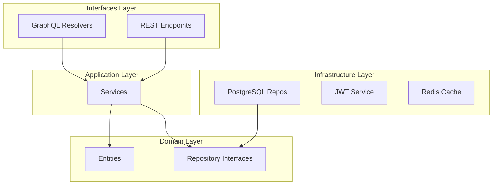

# Agrinova Backend Architecture

## Overview

Backend dibangun dengan **Go** menggunakan **gqlgen** untuk GraphQL API.

---

## 📁 Folder Structure

```
apps/golang/
├── cmd/                     # Entry points
│   ├── server/main.go       # Main server
│   ├── seed/main.go         # Database seeding
│   └── migrate/main.go      # Migrations
├── internal/                # Internal packages
│   ├── auth/                # Authentication
│   │   ├── features/        # Clean architecture
│   │   │   ├── web/         # Cookie-based auth
│   │   │   ├── mobile/      # JWT-based auth
│   │   │   └── shared/      # Shared components
│   │   ├── resolvers/       # GraphQL resolvers
│   │   └── services/        # Business logic
│   ├── master/              # Company, Estate, Division, Block
│   ├── panen/               # Harvest operations
│   ├── gatecheck/           # Gate check operations
│   ├── rbac/                # Role-based access control
│   ├── sync/                # Mobile sync
│   ├── graphql/             # GraphQL setup
│   │   ├── schema/          # .graphqls files
│   │   └── generated/       # gqlgen output
│   └── websocket/           # Real-time features
├── pkg/                     # Shared packages
│   ├── database/            # DB connection
│   └── middleware/          # HTTP middleware
└── scripts/                 # Utility scripts
```

---

## 🏗️ Clean Architecture



---

## 🔧 Key Services

| Service | Location | Function |
|---------|----------|----------|
| `WebAuthService` | `internal/auth/services/` | Cookie authentication |
| `MobileAuthService` | `internal/auth/services/` | JWT authentication |
| `JWTService` | `internal/auth/services/` | Token generation |
| `HarvestService` | `internal/panen/services/` | Harvest CRUD |
| `GateCheckService` | `internal/gatecheck/services/` | Gate operations |
| `SyncService` | `internal/sync/services/` | Mobile sync |

---

## 📡 GraphQL Setup

### Schema Files (29 total)

| File | Size | Purpose |
|------|------|---------|
| `auth.graphqls` | 22.7 KB | Authentication |
| `manager.graphqls` | 12.8 KB | Manager role |
| `asisten.graphqls` | 14.8 KB | Asisten role |
| `mandor.graphqls` | 14.8 KB | Mandor role |
| `satpam.graphqls` | 17.4 KB | Satpam role |
| `super_admin.graphqls` | 17.6 KB | Super Admin |

### Code Generation

```bash
cd apps/golang
go generate ./...
```

---

## 🔐 Middleware Stack

```go
// Request flow
Request → Logger → CORS → RateLimiter → Auth → Resolver
```

| Middleware | Function |
|------------|----------|
| `LoggerMiddleware` | Request logging |
| `CORSMiddleware` | Cross-origin support |
| `RateLimiterMiddleware` | Rate limiting |
| `AuthMiddleware` | JWT/Cookie validation |
| `RBACMiddleware` | Permission checking |

---

## 🚀 Running Backend

```bash
cd apps/golang

# Development
go run ./cmd/server/main.go

# With hot reload
air

# Production
go build -o agrinova ./cmd/server
./agrinova
```

---

## 📊 Database Connection

```go
// pkg/database/database.go
dsn := fmt.Sprintf(
    "host=%s port=%s user=%s password=%s dbname=%s sslmode=disable",
    host, port, user, password, dbname,
)
db, err := gorm.Open(postgres.Open(dsn), &gorm.Config{})
```
