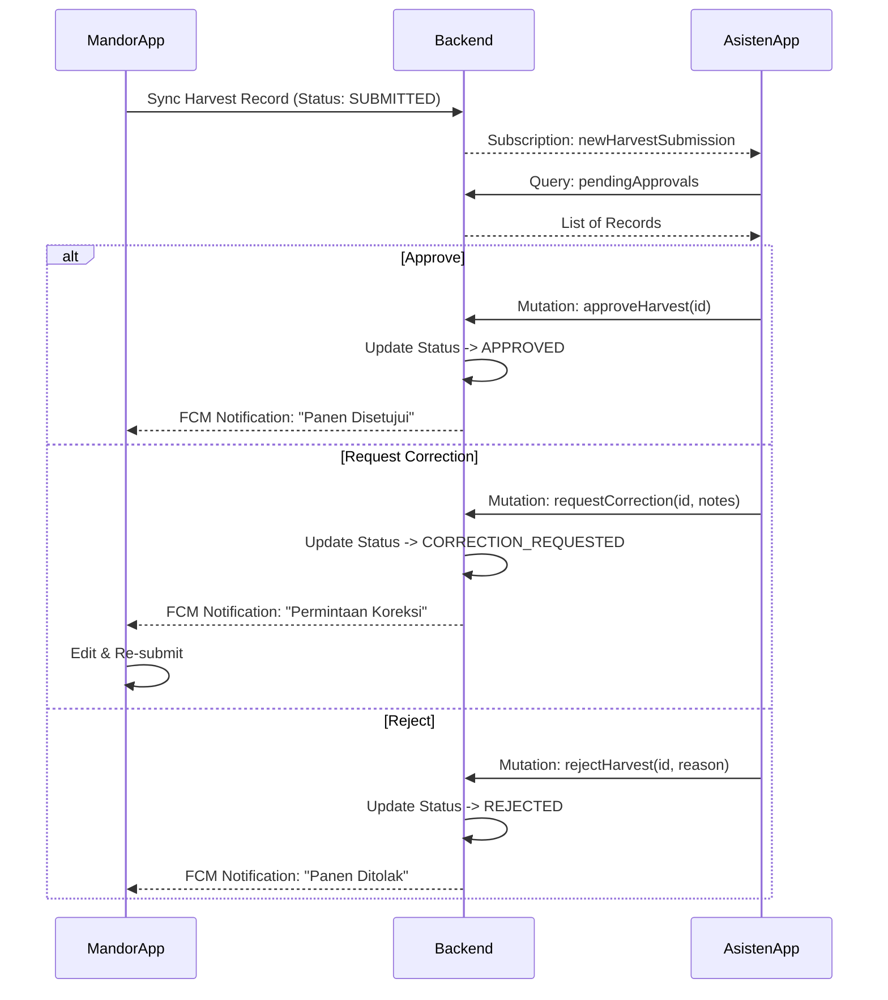

# Blueprint Alur Proses - Asisten Domain

Dokumen ini menjelaskan alur proses (blueprint) untuk domain **Asisten** dalam aplikasi Agrinova. Role Asisten berfokus pada **Monitoring** (kegiatan panen real-time) dan **Approval** (validasi hasil panen dari Mandor).

## 1. Overview Role Asisten

| Atribut | Deskripsi |
| :--- | :--- |
| **Platform** | Mobile App (Flutter) |
| **Sifat Data** | Online-First (Membutuhkan koneksi internet untuk approval & monitoring) |
| **Tanggung Jawab Utama** | Memvalidasi input panen Mandor, Memonitor kinerja blok/mandor secara real-time. |
| **Akses Data** | Terbatas pada Divisi yang ditugaskan. |

## 2. Authentication Flow

Asisten menggunakan login berbasis JWT standard (bukan offline-first token).

1.  **Input Credentials**: User memasukkan username & password.
2.  **Request Login**: Mobile app memanggil mutation `mobileLogin`.
3.  **Token Storage**: Penerimaan `accessToken` dan `refreshToken`. Disimpan di `FlutterSecureStorage`.
4.  **Role Check**: Sistem memvalidasi role = `ASISTEN`. Jika tidak sesuai, akses ditolak.
5.  **Redirect**: Masuk ke **Asisten Dashboard**.

## 3. Dashboard Workflow

Dashboard adalah entry point utama untuk melihat ringkasan operasional harian.

### Data Fetching
- **Query**: `asistenDashboard`
- **Data Points**:
    - Statistik Harian: Total TBS, Estimasi Tonase, Jumlah Mandor Aktif.
    - Pending Items: Menampilkan count item yang menunggu approval.
    - Quick Actions: Shortcut ke fitur vital (e.g., "Batch Approve", "View Monitoring").

### Alur Interaksi
1.  **Load Dashboard**: App merequest data dashboard saat inisialisasi.
2.  **Pull-to-Refresh**: User dapat merefresh data statistik.
3.  **Navigation**: Dari sini user navigasi ke **Approval List** atau **Monitoring Map**.

---

## 4. Approval Workflow (Core Feature)

Proses validasi data panen yang dikirim oleh Mandor.

### 4.1. Viewing Pending Approvals
- **Query**: `pendingApprovals(filter: { status: SUBMITTED_BY_MANDOR })`
- **Tampilan**: List card berisi ringkasan (Blok, Mandor, Total TBS, Waktu Submit).
- **Indikator**:
    - ⏳ *Elapsed Time*: Lama waktu menunggu (e.g., "Setor 2 jam lalu").
    - ⚠️ *Validation Status*: Warning jika data aneh (e.g., TBS per janjang di luar kewajaran).

### 4.2. Detail & Validation
Saat item dipilih, detail ditampilkan:
- **Data**: List pekerja, total janjang, berat, foto bukti (jika ada), koordinat GPS.
- **Validasi Sistem**: Backend memberikan hint `validationStatus` (VALID, WARNING, ERROR).

### 4.3. Action Execution
Asisten memiliki 3 opsi aksi pada `ApprovalItem`:

#### A. Approve (Setujui)
- **Mutation**: `approveHarvest(id: ID!, notes: String)`
- **Alur**:
    1.  User klik "Approve".
    2.  Status record berubah menjadi `APPROVED`.
    3.  Data diteruskan ke tahap selanjutnya (e.g., Timbangan/Transport).
    4.  Notifikasi terkirim ke Mandor (via FCM).

#### B. Request Correction (Koreksi)
- **Mutation**: `requestCorrection(id: ID!, corrections: [String!]!)`
- **Alur**:
    1.  User menemukan kesalahan minor (e.g., salah tipe pekerja).
    2.  User input catatan koreksi.
    3.  Status berubah menjadi `CORRECTION_REQUESTED`.
    4.  Mandor menerima notifikasi untuk edit data dan submit ulang.

#### C. Reject (Tolak)
- **Mutation**: `rejectHarvest(id: ID!, reason: String!)`
- **Alur**:
    1.  Data invalid fatal (e.g., panen fiktif).
    2.  User input alasan penolakan.
    3.  Status berubah menjadi `REJECTED`.
    4.  Record "mati" (tidak bisa diedit lagi oleh Mandor, harus buat baru).

### 4.4. Batch Approval
Untuk mempercepat proses jika data tervalidasi aman.
- **Mutation**: `batchApproval`
- **Flow**: User memilih multiple items -> Klik Approve All -> Backend memproses dalam satu transaksi.

---

## 5. Monitoring Workflow

Proses pemantauan aktivitas lapang secara real-time.

### 5.1. Division Monitoring
- **Query**: `asistenMonitoring` / `divisionMonitoring`
- **Subscription**: `asistenMonitoringUpdate` (Real-time update)
- **View**:
    - Progress Bar: Realisasi vs Target Harian Divisi.
    - Status Blok: Blok mana yang sedang aktif panen (`ACTIVE`), istirahat (`PAUSED`), atau selesai (`COMPLETED`).

### 5.2. Mandor Tracking
- **Query**: `mandorStatuses`
- **Data**:
    - Status Online/Offline Mandor.
    - Lokasi terakhir (Last Seen & Block).
    - Produktivitas per jam.

---

## 6. Data Flow Diagram (Conceptual)

## 7. State Management & Offline Handling
Meskipun Asisten **tidak offline-first**, aplikasi harus menangani kondisi sinyal buruk (spotty connection):
- **Optimistic UI**: Saat klik Approve, UI langsung update "Disetujui" sementara request dikirim di background.
- **Error Handling**: Jika request gagal, user diberitahu dan status dikembalikan (rollback).
- **Caching**: Data dashboard & list approval dicache (`Hive`/`SQLite`) agar tetap bisa dilihat saat blank spot, namun aksi (Approve/Reject) didisable sampai online kembali.
