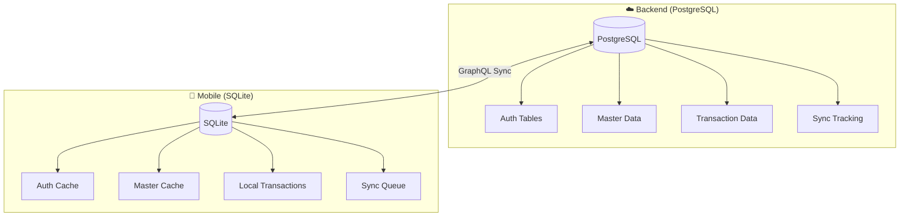
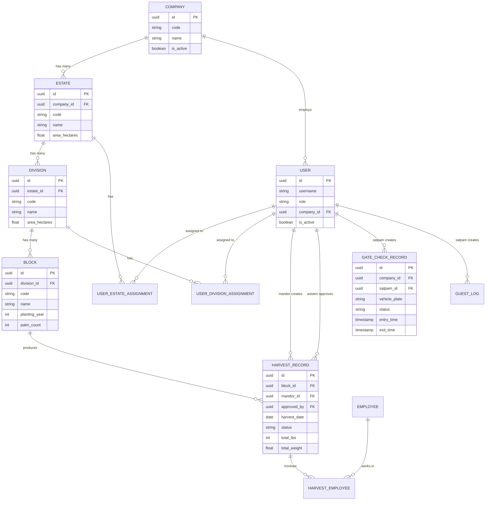
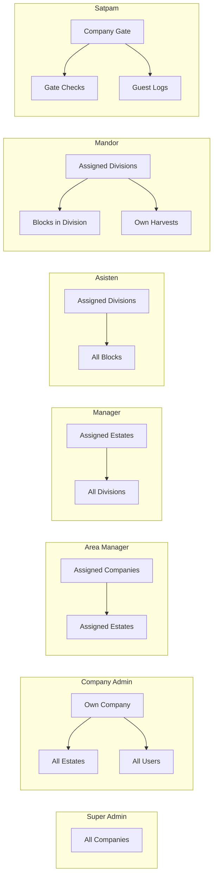

# Agrinova Database Documentation

## Overview

Agrinova menggunakan **dual-database architecture**:
- **PostgreSQL** - Backend server database (source of truth)
- **SQLite** - Mobile local database (offline-first)

---

## 🗄️ Database Architecture



---

## 📊 Entity Relationship Diagram (Core)



---

## 📋 Table Definitions

### 1. Authentication & Security

| Table | Description | Key Columns |
|-------|-------------|-------------|
| `users` | User accounts | id, username, role, company_id, is_active |
| `user_sessions` | Web sessions | user_id, token, expires_at, revoked |
| `device_bindings` | Mobile devices | user_id, device_id, platform, is_trusted |
| `jwt_tokens` | Token tracking (mobile) | user_id, token_type, expires_at |
| `security_events` | Audit trail | user_id, event_type, severity |

### 2. Master Data (Hierarchical)

| Table | Description | Parent | Key Columns |
|-------|-------------|--------|-------------|
| `companies` | Palm oil companies | - | id, code, name |
| `estates` | Plantation estates | company | company_id, area_hectares |
| `divisions` | Estate divisions | estate | estate_id, area_hectares |
| `blocks` | Planting blocks | division | division_id, planting_year, palm_count |
| `employees` | Field workers | company | company_id, employee_code, position |

### 3. User Assignments

| Table | Description | Key Columns |
|-------|-------------|-------------|
| `user_estate_assignments` | Manager → Estates | user_id, estate_id, is_active |
| `user_division_assignments` | Asisten/Mandor → Divisions | user_id, division_id, is_active |
| `user_company_assignments` | Area Manager → Companies | user_id, company_id, permissions |

### 4. Harvest (Panen) Operations

| Table | Description | Key Columns |
|-------|-------------|-------------|
| `harvest_records` | Main harvest data | block_id, mandor_id, harvest_date, status |
| `harvest_employees` | Workers in harvest | harvest_id, employee_id, tbs_count |
| `tbs_records` | Individual TBS | harvest_id, weight, ripeness, quality |

**Status Flow:**
```
PENDING → APPROVED/REJECTED → PKS_RECEIVED → PKS_WEIGHED
```

### 5. Gate Check (Satpam) Operations

| Table | Description | Key Columns |
|-------|-------------|-------------|
| `gate_check_records` | Vehicle entry/exit | vehicle_plate, entry_time, exit_time, status |
| `guest_logs` | Guest registration | guest_name, idcard, purpose, status |
| `qr_tokens` | QR validation tokens | jti, allowed_scan, status, expires_at |

**Status Flow:**
```
ENTERING → INSIDE → EXITING → EXITED
```

### 6. Synchronization (Offline-First)

| Table | Description | Key Columns |
|-------|-------------|-------------|
| `sync_queue` | Pending operations | operation, payload, status, retry_count |
| `sync_conflicts` | Conflict resolution | entity_type, local_data, server_data |
| `sync_logs` | Sync audit | transaction_id, result, synced_at |

---

## 🔐 Role-Based Data Access



---

## 📱 Mobile SQLite Schema Summary

**Total: 25+ tables, ~1000 lines**

| Category | Tables | Offline-First |
|----------|--------|---------------|
| Authentication | 6 | ✅ |
| Master Data | 5 | ✅ (cache) |
| User Assignments | 3 | ✅ (cache) |
| Harvest (Mandor) | 3 | ✅ Full |
| Gate Check (Satpam) | 4 | ✅ Full |
| Synchronization | 3 | ✅ |
| Notifications | 1 | ✅ |

### Sync Status Values
```sql
CHECK (sync_status IN ('PENDING', 'SYNCING', 'SYNCED', 'FAILED', 'CONFLICT'))
```

### Version Control
Every mobile table has:
- `local_version` - Incremented on local changes
- `server_version` - Updated on sync
- `conflict_data` - JSON for conflict resolution

---

## 🔄 Multi-Tenancy

All tables have `company_id` for data isolation:

```sql
-- Example: Get harvests for a specific company
SELECT h.* FROM harvest_records h
JOIN blocks b ON h.block_id = b.id
JOIN divisions d ON b.division_id = d.id
JOIN estates e ON d.estate_id = e.id
WHERE e.company_id = :company_id
```

---

## 📁 Backend Model Locations

```
apps/golang/internal/
├── auth/models/         # User, Session, Device
├── master/models/       # Company, Estate, Division, Block
├── panen/models/        # HarvestRecord, TBS
├── gatecheck/models/    # GateCheck, GuestLog, QRToken
├── rbac/models/         # Role, Permission
├── sync/models/         # SyncQueue, SyncResult
├── employee/models/     # Employee
├── grading/models/      # Grading records
├── weighing/models/     # Weighing records
└── notifications/models/ # Notification
```

---

## 🛠️ Database Commands

### Backend (PostgreSQL)
```bash
# Run migrations
cd apps/golang
go run ./cmd/migrate/main.go

# Seed data
go run ./cmd/seed/main.go

# Drop all tables
go run ./scripts/drop_tables.go
```

### Mobile (SQLite)
```dart
// Database path
final dbPath = await getDatabasesPath();
final db = await openDatabase('$dbPath/agrinova.db');
```
