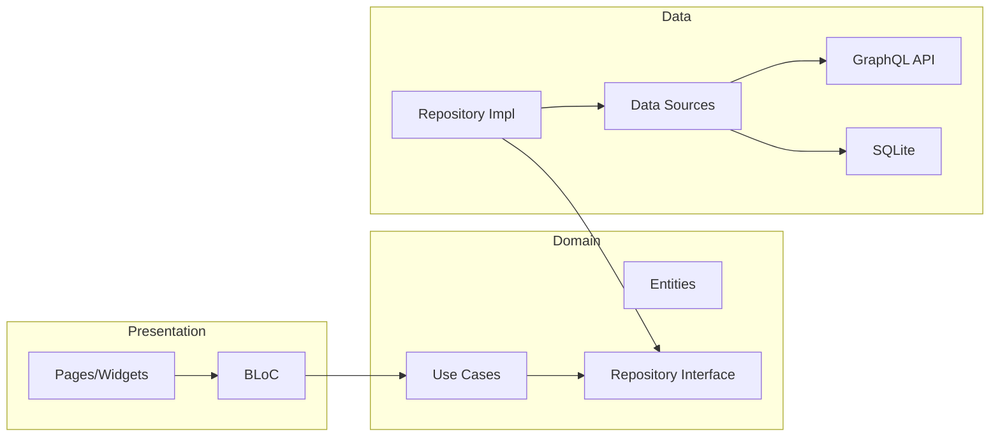
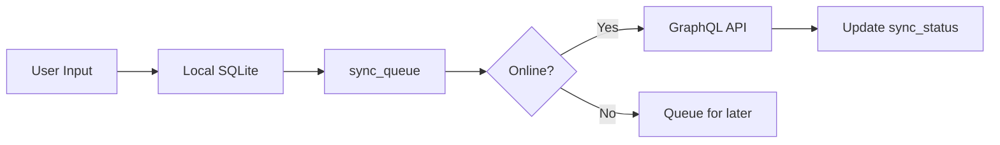

# Agrinova Mobile Architecture

## Overview

Mobile app dibangun dengan **Flutter** menggunakan **BLoC** pattern dan **Clean Architecture**.

---

## 📁 Folder Structure

```
apps/mobile/lib/
├── core/                    # Core components
│   ├── di/                  # Dependency injection
│   │   └── dependency_injection.dart
│   ├── routes/              # Navigation
│   │   └── app_routes.dart
│   ├── services/            # Core services
│   │   ├── jwt_storage_service.dart
│   │   ├── graphql_service.dart
│   │   └── device_service.dart
│   ├── database/            # SQLite
│   │   ├── database_service.dart
│   │   └── mobile_database_schema.sql
│   └── theme/               # App themes
├── features/                # Feature modules
│   ├── auth/                # Authentication
│   │   ├── data/
│   │   ├── domain/
│   │   └── presentation/
│   ├── dashboard/           # Role dashboards
│   │   └── presentation/
│   │       ├── pages/
│   │       │   ├── manager_page.dart
│   │       │   ├── asisten_page.dart
│   │       │   ├── mandor_page.dart
│   │       │   └── satpam_page.dart
│   │       └── blocs/
│   ├── harvest/             # Mandor harvest
│   ├── gate_check/          # Satpam gate check
│   ├── monitoring/          # Real-time monitoring
│   └── profile/             # User profile
└── shared/                  # Shared widgets
```

---

## 🏗️ Clean Architecture



---

## 🔧 State Management (BLoC)

```dart
// Event → BLoC → State
AuthLoginRequested → AuthBloc → AuthLoading → AuthSuccess/AuthFailure

// Example BLoC
class AuthBloc extends Bloc<AuthEvent, AuthState> {
  final AuthRepository _authRepository;
  
  AuthBloc(this._authRepository) : super(AuthInitial()) {
    on<AuthLoginRequested>(_onLoginRequested);
    on<AuthLogoutRequested>(_onLogoutRequested);
  }
}
```

---

## 📱 Role-Specific Dashboards

| Role | Page | Theme | Features |
|------|------|-------|----------|
| MANAGER | `manager_page.dart` | Purple | Monitor, Analytics |
| ASISTEN | `asisten_page.dart` | Blue | Approval, Monitoring |
| MANDOR | `mandor_page.dart` | Green | Input, Riwayat |
| SATPAM | `satpam_page.dart` | Orange | Gate Check, QR |

### Atomic Design Pattern

```
dashboard/presentation/pages/manager_dashboard/
├── atoms/           # Basic components
├── molecules/       # Combined components
└── organisms/       # Complex sections
    ├── manager_welcome_section.dart
    ├── manager_performance_grid.dart
    └── manager_analytics_tab.dart
```

---

## 💾 Offline-First (Mandor & Satpam)



### Sync Tables

| Table | Purpose |
|-------|---------|
| `sync_queue` | Pending operations |
| `sync_conflicts` | Conflict resolution |
| `sync_logs` | Audit trail |

---

## 🔐 Secure Storage

```dart
// JWT tokens stored in flutter_secure_storage
final storage = FlutterSecureStorage();
await storage.write(key: 'access_token', value: token);
await storage.write(key: 'refresh_token', value: refreshToken);
await storage.write(key: 'offline_token', value: offlineToken);
```

---

## 🚀 Running Mobile App

```bash
cd apps/mobile

# Get dependencies
flutter pub get

# Run on device
flutter run

# Build APK
flutter build apk --release

# Build iOS
flutter build ios --release
```

---

## 📦 Key Dependencies

| Package | Version | Purpose |
|---------|---------|---------|
| `flutter_bloc` | ^9.1.1 | State management |
| `go_router` | ^16.2.0 | Navigation |
| `graphql_flutter` | ^5.1.2 | GraphQL client |
| `sqflite` | ^2.3.0 | Local database |
| `flutter_secure_storage` | ^10.0.0 | Secure storage |
| `get_it` | ^8.2.0 | Dependency injection |
