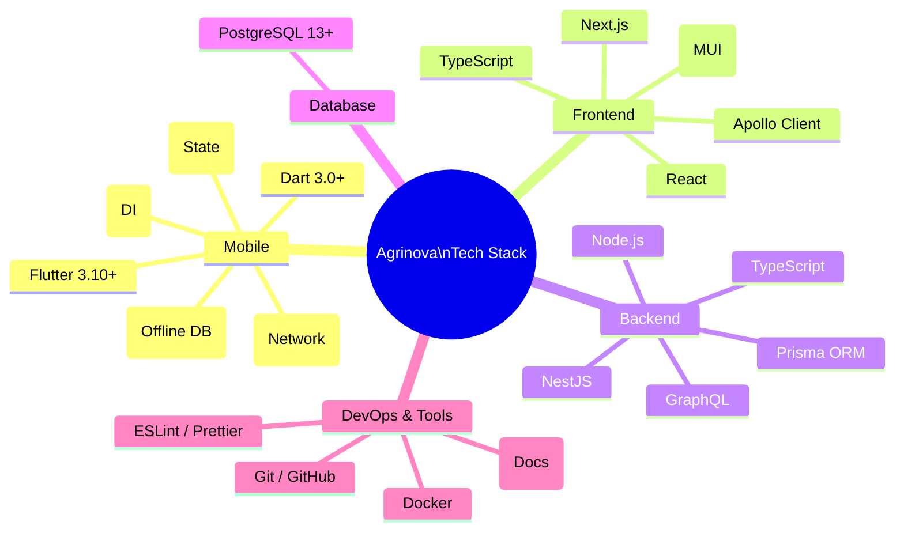
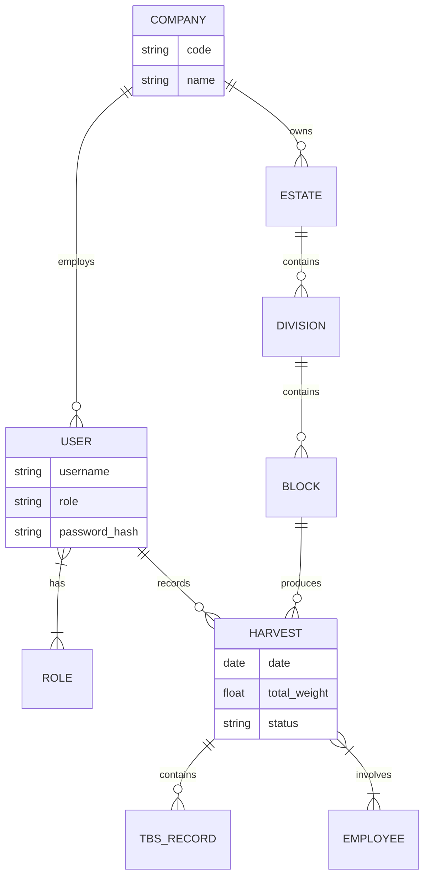

# Agrinova Project Infographics

Due to current limitations in generating high-resolution image files, the following diagrams represent the System Architecture and Technology Stack of the Agrinova project. These can be rendered using any Mermaid-compatible viewer (like GitHub, VS Code, or Mermaid Live Editor).

## 1. System Architecture

This diagram illustrates the high-level architecture, highlighting the offline-first mobile capability, the centralized API, and the data layer.

```mermaid
graph TB
    %% Styling
    classDef client fill:#e1f5fe,stroke:#01579b,stroke-width:2px;
    classDef api fill:#e8f5e9,stroke:#2e7d32,stroke-width:2px;
    classDef data fill:#fff3e0,stroke:#ef6c00,stroke-width:2px;
    classDef storage fill:#f3e5f5,stroke:#7b1fa2,stroke-width:2px;

    subgraph Client_Layer [Client Layer]
        direction TB
        Mobile[📱 Mobile App\n(Flutter)]:::client
        Web[💻 Web Dashboard\n(Next.js)]:::client
        
        subgraph Mobile_Internal [Mobile Internals]
            SQLite[(Local SQLite)]:::storage
            SyncAgent[Sync Agent]:::client
        end
        
        Mobile --- SyncAgent
        Mobile --- SQLite
    end

    subgraph API_Layer [API Layer]
        direction TB
        API[⚙️ Backend API\n(Node.js / NestJS)]:::api
        Auth[🛡️ Auth Service\n(JWT + Biometric)]:::api
        SyncProc[🔄 Sync Processor]:::api
        
        API --- Auth
        API --- SyncProc
    end

    subgraph Data_Layer [Data Layer]
        direction TB
        Prisma[Prisma ORM]:::data
        Postgres[(🐘 PostgreSQL)]:::data
    end

    %% Connections
    SyncAgent <==>|Encrypted Sync| SyncProc
    Web <-->|GraphQL / REST| API
    
    API --> Prisma
    SyncProc --> Prisma
    Prisma <--> Postgres

    %% Descriptions
    linkStyle 0 stroke:#01579b,stroke-width:2px;
    linkStyle 3 stroke:#2e7d32,stroke-width:2px;
```

## 2. Technology Stack

This mindmap categorizes the core technologies used across the Agrinova ecosystem.



## 3. Database Schema Overview (Simplified)

A high-level view of the core entity relationships.


