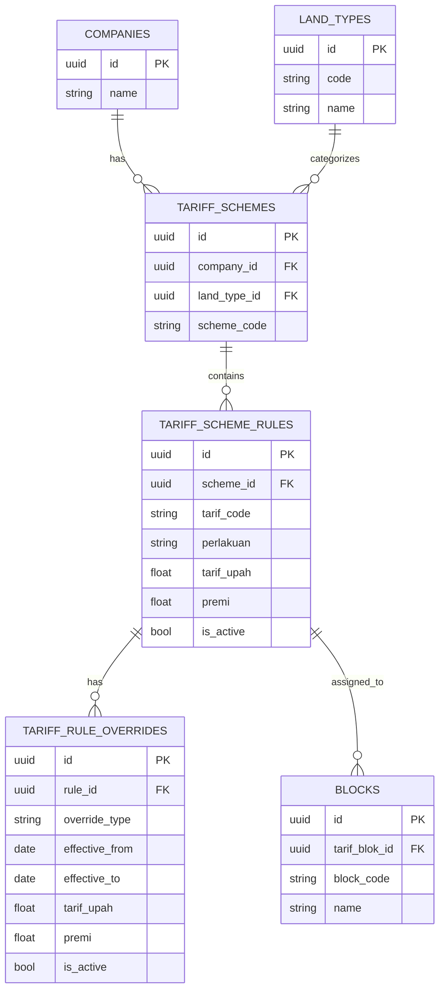
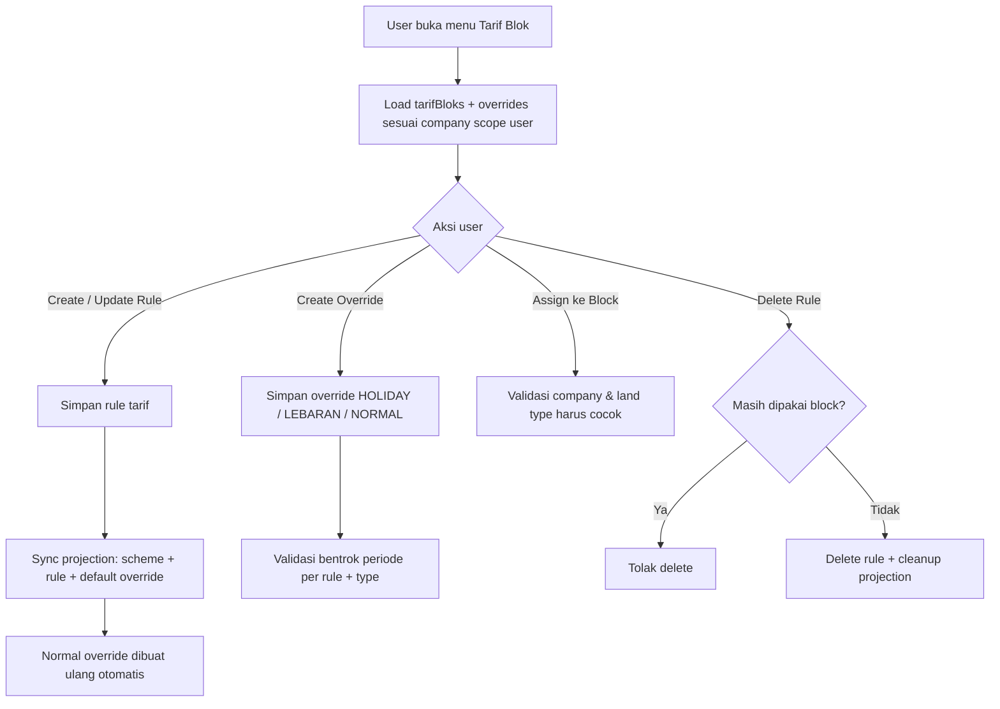

# Tarif Blok Flow (Non-Dev Friendly)

Dokumen ini menjelaskan cara kerja fitur `Tarif Blok` dari sisi bisnis dan teknis secara ringkas.

## 1) Gambaran Sederhana

`Tarif Blok` adalah aturan tarif kerja panen per company.  
Aturan ini dipilih di level blok (`Block`) dan bisa punya override konteks:

- `NORMAL` (default)
- `HOLIDAY` (hari libur)
- `LEBARAN` (periode Lebaran)

## 2) Relasi Data (ERD Ringkas)

Catatan:
- `tarif_blok` saat ini dipertahankan sebagai compatibility view untuk API/UI lama.
- Data sumber utamanya sudah dinormalisasi ke 3 tabel: `tariff_schemes`, `tariff_scheme_rules`, `tariff_rule_overrides`.

## 3) Alur Bisnis Utama

## 4) Aturan Penting yang Perlu Diingat

1. Scope data mengikuti company assignment di profil user.
2. Rule tarif tidak boleh bentrok kode unik dalam scope yang sama (per company + skema/land type).
3. `NORMAL` biasanya selalu ada karena dibuat otomatis saat save rule tarif.
4. Override periode aktif untuk kombinasi `rule + override_type` tidak boleh overlap.
5. Rule tarif tidak bisa dihapus jika masih dipakai oleh block.
6. Block hanya boleh memakai tarif dari company yang sama dan land type yang kompatibel.

## 5) Contoh Praktis

1. Admin Company A membuat rule:
- `Tarif Code`: `BJR20`
- `Scheme`: `KATEGORI_BJR`
- `Tarif Upah`: `120000`

2. Sistem otomatis membentuk:
- 1 row `tariff_scheme_rules`
- 1 row override `NORMAL` (tanpa periode)

3. Admin menambah override `HOLIDAY` periode 2026-12-24 s/d 2026-12-31:
- nilai `tarif_upah` naik, misal `140000`

4. Jika ada override `HOLIDAY` lain dengan periode overlap untuk rule yang sama:
- sistem menolak (conflict).

## 6) Ringkasan untuk Tim Operasional

- Rule dasar tarif dikelola di `Tarif Blok`.
- Kenaikan musiman/libur dikelola via `Override`.
- Seluruh data tetap aman per company scope.
- Perubahan rule langsung disinkronkan ke model tarif baru di backend.
