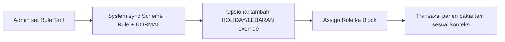

# Tarif Blok - One Pager

## 1. Apa Itu Tarif Blok

- Master aturan tarif kerja panen per company.
- Dipasang ke `Block` lewat `tarif_blok_id`.
- Mendukung konteks tarif:
  - `NORMAL` (default)
  - `HOLIDAY` (hari libur)
  - `LEBARAN` (periode Lebaran)

## 2. Alur Kerja Singkat

## 3. Rule Utama Sistem

- Scope data selalu ikut company assignment user.
- Rule tidak boleh duplikat dalam scope yang sama.
- Override aktif tidak boleh bentrok periode untuk `rule + type` yang sama.
- Rule tidak bisa dihapus jika masih dipakai blok.
- Block hanya bisa pakai tarif dari company yang sama dan land type kompatibel.

## 4. Dampak Operasional

- Tarif dasar konsisten lintas blok.
- Tarif musiman/libur bisa diatur tanpa ubah rule utama.
- Risiko salah tarif antar company berkurang karena company scope enforced.
- Audit perubahan tarif lebih mudah (rule dan override terpisah).

## 5. Checklist Go-Live

- Pastikan setiap company punya rule `NORMAL` aktif.
- Verifikasi periode `HOLIDAY/LEBARAN` tidak overlap.
- Validasi seluruh block sudah ter-assign ke rule yang benar.
- Uji export list blok per tarif untuk verifikasi lapangan.

## 6. Keputusan Bisnis Cepat

- Perubahan tarif harian: edit `NORMAL` atau buat override berperiode.
- Perubahan khusus libur nasional: gunakan `HOLIDAY`.
- Perubahan khusus musim Lebaran: gunakan `LEBARAN`.
- Jangan hapus rule yang sudah dipakai; lakukan reassign block dulu.
