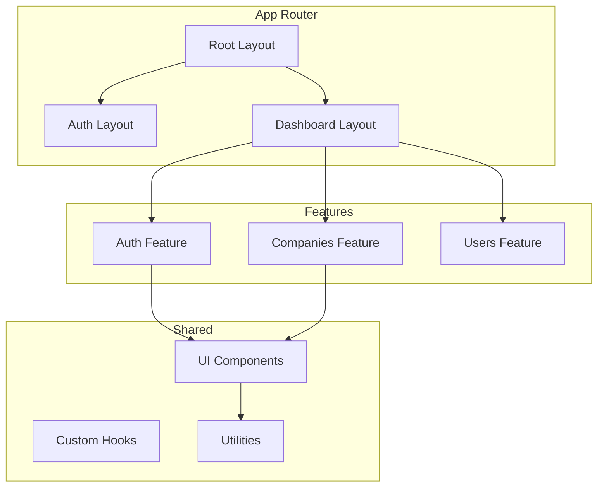

# Agrinova Web Architecture

## Overview

Web dashboard dibangun dengan **Next.js 16.x** menggunakan **App Router** dan **Apollo Client**.

---

## 📁 Folder Structure

```
apps/web/
├── app/                     # Next.js App Router
│   ├── (auth)/              # Auth routes group
│   │   └── login/
│   ├── (dashboard)/         # Dashboard routes
│   │   ├── layout.tsx       # Dashboard layout
│   │   ├── page.tsx         # Main dashboard
│   │   ├── companies/       # Company management
│   │   ├── users/           # User management
│   │   ├── estates/         # Estate management
│   │   ├── harvests/        # Harvest monitoring
│   │   └── settings/        # Settings
│   └── layout.tsx           # Root layout
├── features/                # Feature modules
│   ├── auth/                # Authentication
│   │   ├── components/
│   │   │   ├── AuthProvider.tsx
│   │   │   └── LoginForm.tsx
│   │   └── hooks/
│   ├── companies/           # Company CRUD
│   ├── users/               # User management
│   └── dashboard/           # Dashboard components
├── components/              # Shared components
│   ├── ui/                  # Shadcn/UI components
│   └── layout/              # Layout components
├── lib/                     # Utilities
│   ├── apollo-client.ts
│   └── utils.ts
├── gql/                     # GraphQL
│   └── graphql.ts           # Generated types
└── public/                  # Static assets
```

---

## 🏗️ Component Architecture



---

## 🔐 Authentication Flow

```tsx
// features/auth/components/AuthProvider.tsx
export function AuthProvider({ children }) {
  const [user, setUser] = useState(null);
  const [webLoginMutation] = useMutation(WEB_LOGIN);
  const [logoutMutation] = useMutation(LOGOUT);
  
  const login = async (credentials) => {
    const { data } = await webLoginMutation({ variables: { input: credentials } });
    if (data.webLogin.success) {
      setUser(data.webLogin.user);
      router.push('/dashboard');
    }
  };
  
  return <AuthContext.Provider value={{ user, login, logout }}>{children}</AuthContext.Provider>;
}
```

---

## 📡 Apollo Client Setup

```typescript
// lib/apollo-client.ts
const httpLink = createHttpLink({
  uri: process.env.NEXT_PUBLIC_GRAPHQL_URL,
  credentials: 'include', // Cookie auth
});

const client = new ApolloClient({
  link: httpLink,
  cache: new InMemoryCache(),
});
```

---

## 🎨 UI Components (Shadcn/UI)

| Component | Usage |
|-----------|-------|
| `Button` | Actions |
| `Card` | Content containers |
| `DataTable` | Data display |
| `Dialog` | Modals |
| `Form` | Form handling |
| `Toast` | Notifications |

---

## 🚀 Running Web App

```bash
cd apps/web

# Install dependencies
npm install

# Development
npm run dev

# Production build
npm run build
npm start
```

---

## 🔒 Role-Based Routes

| Route | Roles | Description |
|-------|-------|-------------|
| `/dashboard` | All | Main dashboard |
| `/companies` | SUPER_ADMIN | Company CRUD |
| `/users` | COMPANY_ADMIN, SUPER_ADMIN | User management |
| `/estates` | COMPANY_ADMIN | Estate management |
| `/harvests` | MANAGER, ASISTEN | Harvest monitoring |
| `/settings` | All | User settings |
