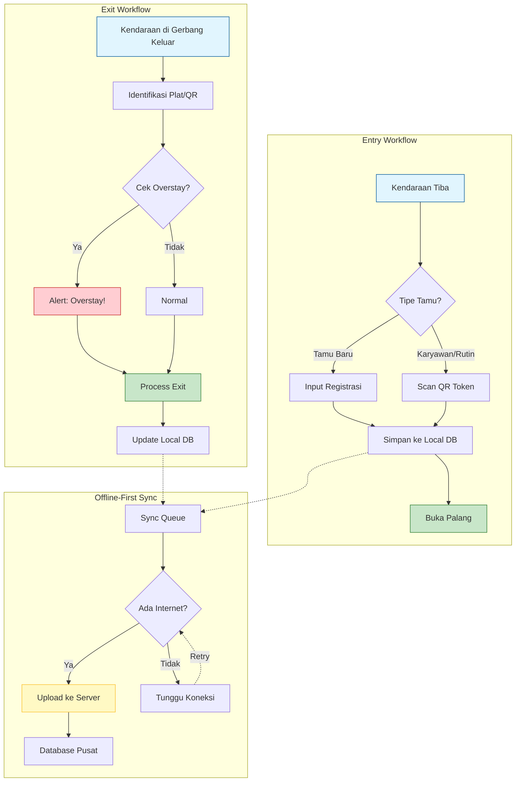

# Agrinova: Modul Satpam
## Fokus Pembahasan: Keamanan & Kontrol Akses

---

## 1. Pendahuluan
Modul Satpam adalah garda terdepan dalam sistem keamanan perkebunan Agrinova. Aplikasi ini dirancang untuk mempermudah petugas keamanan dalam memantau arus keluar-masuk kendaraan, tamu, dan karyawan, serta memastikan data lapangan tercatat secara akurat bahkan di area tanpa sinyal internet.

### Peran Utama
*   **Gatekeeper:** Mengontrol akses masuk dan keluar (Check-in/Check-out).
*   **Keamanan:** Memantau kendaraan yang melebihi batas waktu kunjungan (Overstay).
*   **Digitalisasi:** Menggantikan buku tamu manual dengan sistem digital terintegrasi.

---

## 2. Fitur Utama

### A. Dashboard Terpadu (Enhanced Dashboard)
Pusat informasi real-time bagi petugas Satpam:
*   **Statistik Harian:** Jumlah kendaraan masuk/keluar hari ini, tamu terdaftar, dan scan QR.
*   **Vehicles Inside:** Daftar kendaraan yang saat ini masih berada di dalam area perkebunan.
*   **Shift Info:** Ringkasan aktivitas petugas selama shift berjalan.
*   **Sync Status:** Indikator status koneksi dan antrian data yang belum terkirim ke server.

### B. Registrasi Tamu & Kendaraan (Guest Log)
Formulir digital untuk mencatat setiap kunjungan:
*   **Data Lengkap:** Nama Supir, Plat Nomor, Jenis Kendaraan, Tujuan, dan Pihak yang Dikunjungi.
*   **Foto Bukti:** Ambil foto kendaraan/surat jalan langsung dari aplikasi.
*   **Estimasi Durasi:** Penetapan batas waktu kunjungan untuk monitoring overstay.

### C. Validasi QR Code (Quick Access)
Mempercepat proses pemeriksaan untuk karyawan atau tamu rutin:
*   **Scan & Go:** Cukup scan QR Token untuk validasi identitas dan izin akses.
*   **Validasi Offline:** QR Token berisi data terenkripsi (JWT) yang dapat diverifikasi tanpa koneksi internet.
*   **Pencegahan Penipuan:** Token memiliki kadaluarsa dan validasi keamanan.

### D. Manajemen Overstay (Peringatan Dini)
Sistem otomatis menandai kendaraan yang melebihi estimasi waktu kunjungan:
*   **Visual Alert:** Indikator warna pada daftar kendaraan yang "Overstay".
*   **Monitoring Keamanan:** Membantu Satpam mengidentifikasi potensi masalah keamanan atau insiden di lapangan.

---

## 3. Alur Kerja (Workflow)

### Skenario 1: Kendaraan Masuk (Entry)
1.  **Kendaraan Tiba:** Satpam memeriksa identitas dan tujuan.
2.  **Input Data/Scan QR:**
    *   *Tamu Baru:* Input manual di menu **Guest Registration**.
    *   *Karyawan:* Scan QR Code Karyawan.
3.  **Simpan:** Data disimpan ke database lokal (SQLite).
4.  **Akses Diberikan:** Palang dibuka, kendaraan masuk.

### Skenario 2: Kendaraan Keluar (Exit)
1.  **Kendaraan Tiba di Gerbang Keluar:** Satpam menghentikan kendaraan.
2.  **Identifikasi:** Cari nomor plat di menu **Vehicles Inside** atau Scan QR struk masuk.
3.  **Proses Keluar:** Klik "Process Exit". Sistem menghitung durasi aktual.
4.  **Selesai:** Data status berubah menjadi "Exited".

---

## 4. Teknologi & Keunggulan

### **Offline-First Architecture**
Aplikasi Mobile Satpam dirancang untuk bekerja total di area *Blank Spot*:
1.  **Input Tanpa Sinyal:** Semua data disimpan di memori HP (Local Database).
2.  **Antrian Sinkronisasi:** Data masuk ke `Sync Queue` saat offline.
3.  **Auto-Sync:** Saat mendapat sinyal (Wi-Fi/4G), aplikasi otomatis mengirim data ke server di latar belakang.
4.  **Konflik Resolusi:** Mekanisme cerdas menangani data ganda atau konflik update.

### **Keamanan Data**
*   **Enkripsi:** Token akses terenkripsi.
*   **Audit Trail:** Setiap aktivitas tercatat dengan ID petugas dan waktu yang tidak bisa dimanipulasi.

---

## 5. Kesimpulan
Modul Satpam Agrinova bukan sekadar buku tamu digital, melainkan bagian integral dari sistem pengamanan aset. Dengan mendigitalkan gerbang masuk/keluar, manajemen mendapatkan visibilitas total terhadap arus lalu lintas dan keamanan aset perkebunan secara *real-time* maupun historis.

---

## 6. Visualisasi Alur & Arsitektur

---

## 7. Galeri Visualisasi

Berikut adalah ilustrasi penerapan Satpam Mobile di lapangan:

### Pemeriksaan di Gerbang Utama

### Proses Scan QR Code (Contactless)

### Antarmuka Aplikasi (Mockup)

